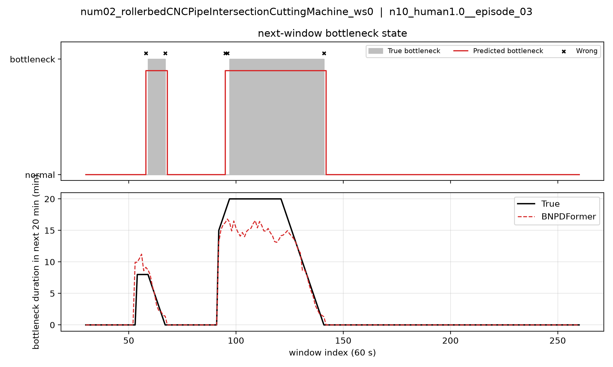
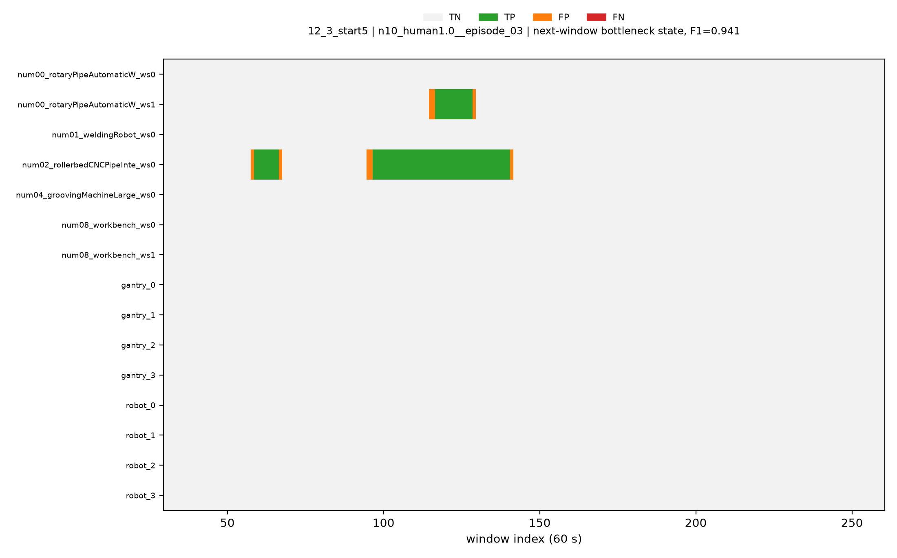
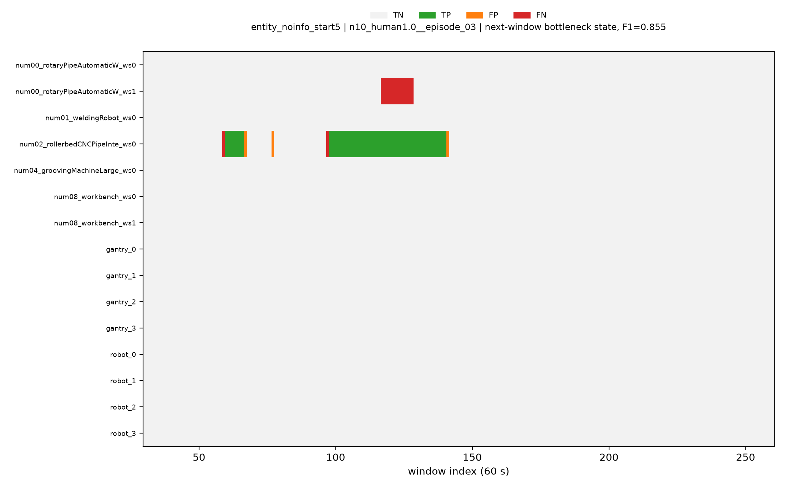
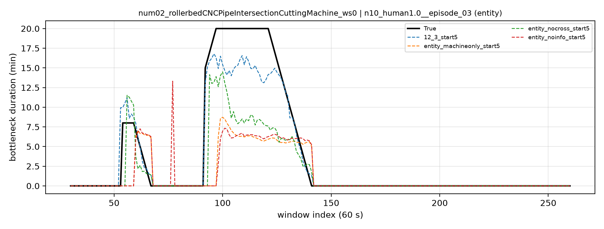
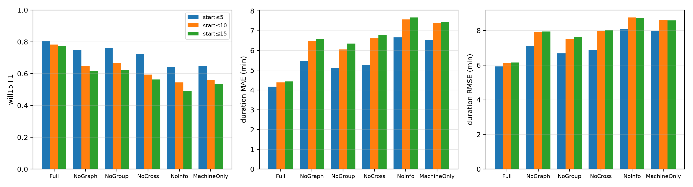

# 09. 瓶颈预测评估（准确性 + 时长 MAE/RMSE + 时序图）

不再把阻塞和饥饿分开算。直接用 BNPDFormer 的瓶颈事件输出（哪台设备、什么时候开始、持续多久），回答三个问题：

1. 瓶颈有没有报对：will15 P/R/F1，以及每个未来窗口的瓶颈状态是否判对；
2. 瓶颈时长报得准不准：duration MAE / RMSE（分钟）；
3. 画出来是什么样：关键设备的 true vs pred 时序图、全设备对错热力图、消融对比图。

时间粒度、预测步长、阈值都沿用训练和 `ablation_best_metrics` 的口径，不向论文对齐。

---

## 1. 模型输出与真值

**模型输出**（`model.predict`，和训练时的测试流程是同一条路径）：


| 输出                | 形状     | 含义                     |
| ----------------- | ------ | ---------------------- |
| `event_will_prob` | (B, N) | 设备 n 在未来 20 分钟内出现瓶颈的概率 |
| `event_start_idx` | (B, N) | 瓶颈开始的窗口（0 表示瓶颈正在进行）    |
| `event_dur`       | (B, N) | 瓶颈持续的窗口数（分钟）           |


**判定为报出瓶颈**：先用 `apply_ongoing_will_force` 对正在进行的瓶颈做概率抬升，然后 will_prob ≥ 阈值。阈值取训练报告里测试集用的 `report_threshold_used`，主模型和消融都是 0.94，prefix8 是 0.98。

**真值**（`node_event_targets`，按 `y_hot` 瓶颈占用网格计算）：每台设备在未来 20 个窗口里最长的那段瓶颈。

- 新出现的瓶颈要求持续 ≥ 8 分钟。
- 已经在进行的瓶颈（上一窗口就是瓶颈）≥ 1 分钟就算。
- start5/10/15 分别只统计 5/10/15 分钟内开始的瓶颈。

**一致性检查**：19 个模型的 will15 F1 和 `last_metrics.json` 里训练时的测试结果完全一致（例如主模型 0.805，真值 1102 个、预测 1134 个）。说明评估流程和训练报告是同一口径。

## 2. 设置


| 项          | 值                                                  |
| ---------- | -------------------------------------------------- |
| 数据         | `raw_data/dense_i1`，按 episode 划分 140/28/36，seed 42 |
| 测试集        | 36 个 episode，5354 个预测时刻                            |
| 时间粒度       | 60 s 窗口                                            |
| 输入 / 预测范围  | 过去 30 个窗口 / 未来 20 个窗口                              |
| checkpoint | 每个 run 的 `BNPDFormer_best.pt`                      |


**设备**

- **所有设备**：15 个监督节点，包括 7 台机床/工位（num00 ws0/ws1、num01、num02、num04、num08 ws0/ws1）、4 台龙门（gantry_0–3）、4 台 AGV（robot_0–3）。人和缓存区不算设备。
- **关键设备**：自动选出 `num02_rollerbedCNCPipeIntersectionCuttingMachine_ws0`（滚床数控相贯线切割机），它是测试集里瓶颈最多的设备（301 次）。
  - 规则：只考虑瓶颈次数不低于中位数的设备，在主模型上找出 "该设备瓶颈出现次数最多、并列时单步 F1 最高" 的 设备 × episode 组合。
- **作图 episode**：`n10_human1.0__episode_03`。这个 episode 里关键设备有 2 段瓶颈，而且它也是全设备瓶颈最多的 episode，所以热力图也用它。
- 选择结果写在 `bottleneck_eval/selection.json`。所有模型画图都用同一台设备、同一个 episode。


## 3. 指标


| 指标                  | 含义                                                                                    |
| ------------------- | ------------------------------------------------------------------------------------- |
| will15 P / R / F1   | 设备级：未来 20 分钟内是否会成为瓶颈（主指标，和 ablation_best_metrics 一致）                                  |
| state F1 1step      | 下一个窗口每台设备 "是/否瓶颈" 判对的 F1（由预测的开始和时长展开成占用网格）                                            |
| state F1 K          | 同上，统计全部 20 个窗口                                                                        |
| **dur MAE / RMSE**  | 瓶颈时长误差（分钟），在 "真值有瓶颈或预测有瓶颈" 的 (时刻, 设备) 上算：漏报按预测 0 计，误报按真值 0 计，同时惩罚漏报、误报和时长不准。**主时长指标** |
| dur MAE / RMSE tp   | 只在报对的瓶颈上算时长误差（= 训练日志里的 `dur_mae`）                                                     |
| start MAE / RMSE tp | 报对的瓶颈的开始时间误差（分钟）                                                                      |


state acc（准确率）普遍在 0.99 以上，因为绝大多数窗口不是瓶颈，参考价值不大，所以文中以 F1 为准。

## 4. 怎么跑

```bash
cd source/isaaclab_tasks/isaaclab_tasks/direct/hc_factory/PDFormer
PY=/home/sci/repos/miniconda3/envs/bn_pdformer/bin/python

# 单个模型
$PY -m factory_bn.eval_bottleneck eval \
    --run_dir libcity/cache/model_cache/dense_i1_12_3_start5_min8_cause4_opt_main_seed42

# model_cache 下全部 checkpoint + 汇总 + 画图（本次在 tmux tyx 里跑的就是这个）
$PY factory_bn/run_bottleneck_eval.py 2>&1 | tee libcity/cache/bottleneck_eval/run.log

# 只重新汇总 / 画图
$PY -m factory_bn.eval_bottleneck summarize
```

每个模型约 20 s（RTX 5090），19 个跑完约 7 分钟。

### 代码

- `factory_bn/eval_bottleneck.py`
  - 从 ckpt 里的 `config` + `data_meta` 重建模型和测试集。
  - 按训练同款流程（`predict` → `station_report_metrics`）算官方指标，再加上时长/开始时间的 MAE、RMSE、逐窗口状态 F1 和逐设备指标。
  - `summarize` 子命令出表和图。
- `factory_bn/run_bottleneck_eval.py`：遍历 `libcity/cache/model_cache/*/BNPDFormer_best.pt` 批量跑。
- `factory_bn/dataset.py`：样本里多存一个 `t_index`（窗口位置，画时序图用），不进 batch，不影响训练。
- 老 ckpt（`a1_prefix8`）缺 `adj_row`（由邻接推导的 buffer）和 `precursor_mlp`（零初始化），加载时允许这两项缺失，其余 key 对不上直接报错。
- 上一版按阻塞/饥饿分开评估的 `eval_recon_bs.py` 已删除（git 历史 `9d1eff2` 里还在）。


### 输出

```
libcity/cache/bottleneck_eval/
├── <run>/metrics.json          # 全部指标
├── <run>/per_device.csv        # 逐设备 P/R/F1、时长 MAE/RMSE
├── <run>/series.npz            # 逐时刻逐设备的真值/预测（状态、时长、概率）
├── summary.md / summary.csv    # 19 个模型汇总
├── selection.json              # 关键设备 / episode
└── figures/
    ├── key_device_main.png                       # 关键设备：瓶颈状态 + 时长 true vs pred
    ├── key_device_{start,struct,entity}.png      # 关键设备时长曲线，多模型对比
    ├── all_devices_state_main.png                # 全设备 × 时间 对错热力图（TP/FP/FN）
    ├── all_devices_state_ablation_nograph_start5.png
    ├── all_devices_state_entity_noinfo_start5.png
    └── overview_bars.png                         # 6 组 × 3 档：F1 / 时长 MAE / 时长 RMSE
```


## 5. 结果（19 个 checkpoint 全部跑通）


### 5.1 主模型与消融（所有设备）


| 模型              | start | will15 F1 | state F1 1step | dur MAE  | dur RMSE | dur MAE tp | start MAE tp |
| --------------- | ----- | --------- | -------------- | -------- | -------- | ---------- | ------------ |
| **Full (12_3)** | ≤5    | **0.805** | 0.883          | **4.17** | **5.92** | 1.86       | 0.13         |
|                 | ≤10   | 0.783     | 0.892          | 4.38     | 6.11     | 1.79       | 0.23         |
|                 | ≤15   | 0.772     | 0.900          | 4.43     | 6.15     | 1.72       | 0.23         |
| NoGraph         | ≤5    | 0.747     | 0.873          | 5.48     | 7.12     | 2.98       | 0.02         |
|                 | ≤10   | 0.651     | 0.844          | 6.46     | 7.91     | 3.09       | 0.05         |
|                 | ≤15   | 0.616     | 0.865          | 6.57     | 7.94     | 3.04       | 0.07         |
| NoGroup         | ≤5    | 0.761     | 0.835          | 5.11     | 6.68     | 2.59       | 0.17         |
|                 | ≤10   | 0.668     | 0.826          | 6.05     | 7.48     | 2.43       | 0.46         |
|                 | ≤15   | 0.623     | 0.819          | 6.34     | 7.64     | 2.49       | 0.52         |
| NoCross         | ≤5    | 0.723     | 0.812          | 5.28     | 6.87     | 2.59       | 0.11         |
|                 | ≤10   | 0.595     | 0.759          | 6.60     | 7.96     | 2.51       | 0.34         |
|                 | ≤15   | 0.563     | 0.760          | 6.77     | 8.03     | 2.37       | 0.73         |
| NoInfo          | ≤5    | 0.644     | 0.699          | 6.66     | 8.10     | 3.55       | 0.02         |
|                 | ≤10   | 0.545     | 0.684          | 7.57     | 8.75     | 3.72       | 0.02         |
|                 | ≤15   | 0.490     | 0.596          | 7.66     | 8.72     | 2.94       | 0.77         |
| MachineOnly     | ≤5    | 0.650     | 0.709          | 6.51     | 7.96     | 3.57       | 0.01         |
|                 | ≤10   | 0.559     | 0.708          | 7.40     | 8.62     | 3.60       | 0.00         |
|                 | ≤15   | 0.534     | 0.706          | 7.46     | 8.58     | 3.39       | 0.02         |
| a1_prefix8（旧版）  | —     | 0.854     | 0.868          | 3.39     | 4.85     | 1.96       | 0.09         |


完整列（P、R、state F1 K、RMSE tp 等）见 `bottleneck_eval/summary.md`。

### 5.2 逐设备（Full start≤5）


| 设备                             | 类型      | 真值瓶颈数               | F1                            | dur MAE                   | dur RMSE                  |
| ------------------------------ | ------- | ------------------- | ----------------------------- | ------------------------- | ------------------------- |
| num02_rollerbedCNC（关键设备）       | machine | 301                 | 0.817                         | 4.67                      | 6.45                      |
| num08_workbench_ws0            | machine | 186                 | 0.851                         | 3.47                      | 5.02                      |
| num08_workbench_ws1            | machine | 94                  | 0.964                         | 2.65                      | 3.65                      |
| num00_rotaryPipeWelding_ws0    | machine | 115                 | 0.651                         | 5.31                      | 7.11                      |
| num00_rotaryPipeWelding_ws1    | machine | 17                  | 0.944                         | 1.54                      | 2.76                      |
| num01_weldingRobot_ws0         | machine | 46                  | 0.535                         | 6.04                      | 7.56                      |
| num04_groovingMachineLarge_ws0 | machine | 20                  | 0.638                         | 5.32                      | 6.87                      |
| gantry_0 / 1 / 2 / 3           | gantry  | 18 / 31 / 108 / 121 | 0.682 / 0.800 / 0.817 / 0.831 | 3.35 / 4.55 / 3.59 / 3.56 | 4.85 / 6.45 / 5.56 / 5.04 |
| robot_0 / 1                    | AGV     | 15 / 30             | 0.720 / 0.793                 | 4.01 / 5.03               | 6.14 / 6.80               |
| robot_2 / 3                    | AGV     | 0 / 0               | —                             | —                         | —                         |


### 5.3 图

关键设备（Full start≤5）。上图是下一窗口是否瓶颈，灰色为真值、红线为预测、× 为判错的窗口；下图是未来 20 分钟内的瓶颈时长：



全设备对错热力图（同一 episode），绿色 TP、橙色 FP（误报）、红色 FN（漏报）：





实体消融的时长曲线对比：



总览（6 组 × 3 档）：



## 6. 分析

1. **完整模型的瓶颈预测准确，时长误差也最小。**
  - start≤5：will15 F1 0.805，下一窗口状态 F1 0.883；时长 MAE 4.17 分钟、RMSE 5.92 分钟。报对的瓶颈时长误差只有 1.86 分钟，开始时间误差 0.13 分钟。
  - 关键设备图上，两段瓶颈的开始和结束都对上了。误差主要是开始和结束提前或滞后 1 个窗口，以及长瓶颈（20 分钟封顶段）的时长偏低（预测 14–16 分钟）。
2. **消融后瓶颈判定和时长误差同时变差，排序和 ablation_best_metrics 一致。**
  - 时长 MAE（start≤5）：Full 4.17 < NoGroup 5.11 < NoCross 5.28 < NoGraph 5.48 < MachineOnly 6.51 ≈ NoInfo 6.66。
  - start≤10 / ≤15 下差距更大：Full 4.4 左右，其他 6.0–7.7。
3. **去掉实体信息（NoInfo / MachineOnly）影响最大。**
  - 下一窗口状态 F1 从 0.88 掉到 0.70，报对的瓶颈时长误差几乎翻倍（1.86 → 3.55）。
  - 时长曲线上，NoInfo / MachineOnly 对长瓶颈只能报 6 分钟左右的平线。热力图上 NoInfo 整段漏掉了 num00_ws1 的瓶颈（红色），还多出一处误报。
  - 说明龙门、AGV、人等实体的状态是判断机床瓶颈能持续多久的关键信息。
4. **去掉图（NoGraph）**：准确率还行，但召回明显降低（R 0.68 / 0.54 / 0.48），漏报的瓶颈让时长 MAE 上升到 5.5–6.6。
  **去掉分组（NoGroup）**：误报变多，start≤10/15 时 P 只有 0.61/0.57（Full 为 0.81），时长 MAE 5.1–6.3。
5. **start 档位**：Full 从 start≤5 到 ≤15，F1 只降 0.03、时长 MAE 只升 0.26；消融模型 F1 降 0.12–0.16、时长 MAE 升 0.95–1.5。完整模型对更远的瓶颈更稳。
6. **旧版 a1_prefix8**：F1 0.854、时长 MAE 3.39，数值更高。但它的阈值是 0.98，不是统一的 0.94，而且是更早的协议，所以不放进消融主表对比，只作参考。


## 7. 注意事项

- 时长以分钟为单位，最长 20 分钟（预测范围）。对正在进行的瓶颈，时长是 "从现在起还剩多久"。
- dur MAE / RMSE 包含漏报和误报的惩罚，是比较模型的主指标；dur MAE tp 只看报对的部分，单独看会偏乐观（报得越少越容易小）。
- 对比模型（LSTM / Transformer / BSTAN 等）由组员跑，要按第 1–3 节同样的预测范围、真值定义（最长瓶颈段、新瓶颈 ≥ 8 分钟、start 截断）、设备集和指标口径来算，否则数字不可比。

