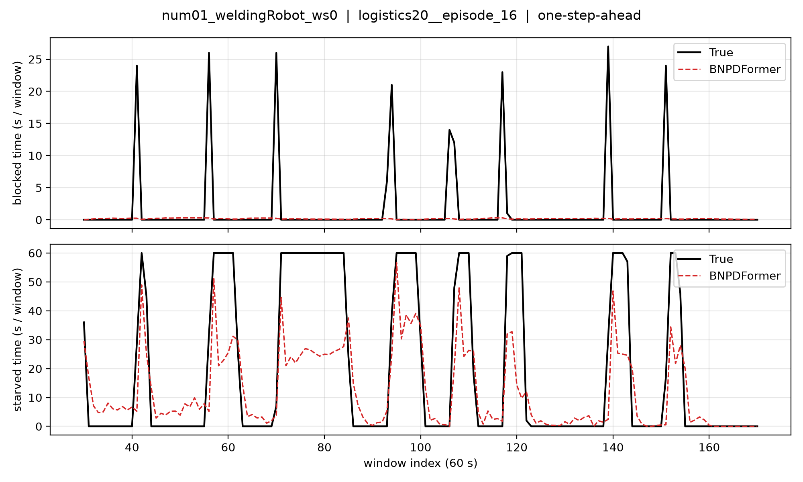
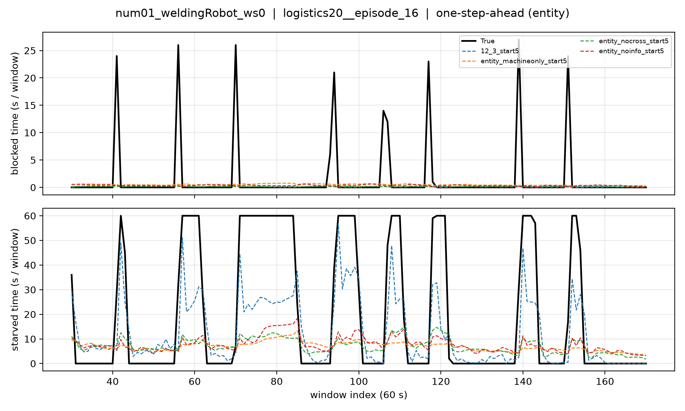
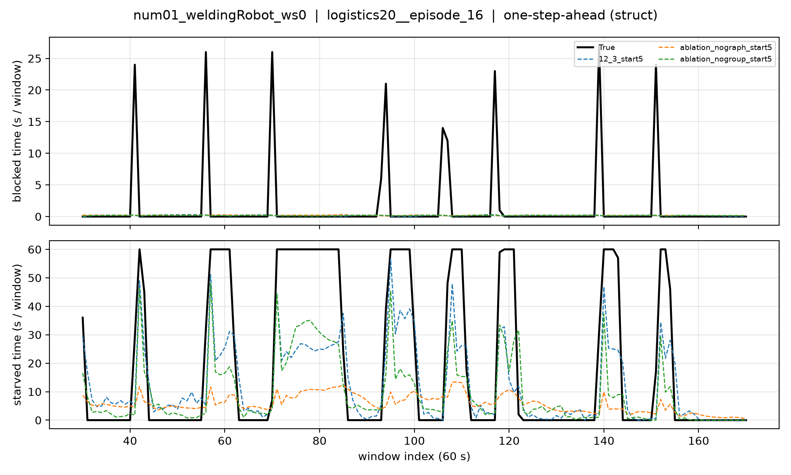
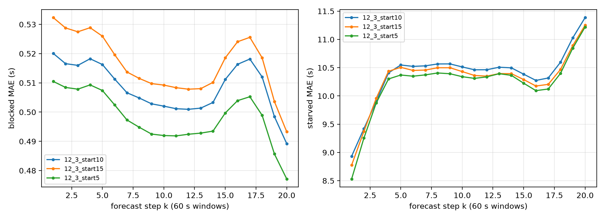

# 09. 阻塞 / 饥饿时长预测评估（recon head）

用 BNPDFormer 无监督分支的 `recon_head` 输出，评估每台设备未来窗口内的**阻塞时长**（blocked time）和**饥饿时长**（starved time），给出 MAE / RMSE 和 true-vs-pred 时间序列图（对应论文里 "blockage / starvation duration prediction" 那类表和图）。
时间粒度、预测步长、数据划分全部沿用我们自己的训练设置，不向论文对齐。

---

## 1. 原理

- `train_mode=unsupervised` 时，模型除事件头外还有 `recon_head`，输出 `out["recon"]`，形状 `(B, K, N, F)`：未来 K 个窗口、N 个节点、F 维窗口特征（标准化空间）。
- F 维特征中：
  - idx 6 `blocked_time_s`：该 60 s 窗口内设备处于阻塞态的秒数（0–60）
  - idx 7 `starved_time_s`：该 60 s 窗口内设备处于饥饿态的秒数（0–60）
- 训练时这两维的 recon 权重较高（`remain.py::_OPS_RECON_HIGH`：blocked 2.0，starved 1.5，其他默认 0.05），总 recon 损失权重 `w_recon=0.2`。
- 评估：`recon[..., 6/7] * std + mean` 反标准化回秒，再裁剪到 `[0, 60]`，与真实未来窗口特征 `y_x[..., 6/7]` 比较。

## 2. 设置（与训练一致）

| 项 | 值 |
|---|---|
| 数据 | `raw_data/dense_i1`，split 140/28/36 episode，seed 42 |
| 测试集 | 36 episode，5354 个预测时刻 |
| 时间粒度 | 60 s 窗口（每个值 = 该分钟内阻塞/饥饿秒数） |
| 输入 | 过去 30 个窗口 |
| 预测步长 | K = 20 个窗口（`occupancy_horizon_windows`），超过 episode 结束的步不计 |
| checkpoint | 每个 run 的 `BNPDFormer_best.pt`（按 will15_f1 选出，不是按 recon 选） |

### 设备选择

- **所有设备**：`occ_node_mask` 监督的 15 个设备节点（7 台机床/工位 + 4 台龙门 + 4 台 AGV），即事件预测里本来就监督的那批；人和缓存区不算设备。
  - num00_rotaryPipeAutomaticWeldingMachine_ws0 / ws1、num01_weldingRobot_ws0、num02_rollerbedCNCPipeIntersectionCuttingMachine_ws0、num04_groovingMachineLarge_ws0、num08_workbench_ws0 / ws1
  - gantry_0–3、robot_0–3
- 另外单独报 **machine 子集**（7 台），因为阻塞只发生在机床上（龙门/AGV 的 blocked 真值恒为 0）。
- **关键设备**：在主模型 `12_3_start5` 上自动选——机床中真值波动（blocked std + starved std）不低于中位数的那几台里，取单步 R² 均值最高的一台 → **`num01_weldingRobot_ws0`**。
- **作图 episode**：关键设备在测试集中阻塞+饥饿波动最大的 episode → **`logistics20__episode_16`**。
- 选择结果写在 `recon_eval/selection.json`，所有模型画图都用同一台设备、同一个 episode。

## 3. 指标

单位均为 **秒 / 60 s 窗口**。

| 名称 | 含义 |
|---|---|
| 1step | 只看第一个未来窗口（one-step-ahead） |
| horizon | 全部有效 K 步取平均 |
| active | 只在真值 > 0 的窗口上算（排除大量 0 值对 MAE 的稀释） |
| R² | 1 − SS_res / SS_tot，衡量是否跟上波动 |
| persist | 把最后一个观测窗口原样复制当预测，仅作 sanity 下限参考，不是对比模型 |

## 4. 怎么跑

```bash
cd source/isaaclab_tasks/isaaclab_tasks/direct/hc_factory/PDFormer
PY=/home/sci/repos/miniconda3/envs/bn_pdformer/bin/python

# 单个模型
$PY -m factory_bn.eval_recon_bs eval \
    --run_dir libcity/cache/model_cache/dense_i1_12_3_start5_min8_cause4_opt_main_seed42

# model_cache 下全部 checkpoint + 汇总 + 画图（本次在 tmux tyx 里跑的就是这个）
$PY factory_bn/run_recon_bs_eval.py 2>&1 | tee libcity/cache/recon_eval/run.log

# 只重新汇总 / 画图
$PY -m factory_bn.eval_recon_bs summarize
```

每个模型约 10 s（RTX 5090），19 个全部跑完约 4 分钟。

### 代码改动

- 新增 `factory_bn/eval_recon_bs.py`：从 ckpt 里的 `config` + `data_meta`（邻接、pattern keys、scaler）原样重建模型和测试集，导出 recon 预测并算指标；`summarize` 子命令出表和图。
- 新增 `factory_bn/run_recon_bs_eval.py`：遍历 `libcity/cache/model_cache/*/BNPDFormer_best.pt` 批量跑。
- `factory_bn/dataset.py`：样本里多存一个 `t_index`（窗口位置，用于画时间序列），不进 batch，不影响训练。
- 老 ckpt（`dense_i1_a1_prefix8`）缺 `adj_row`（由邻接推导的 buffer）和 `precursor_mlp`（零初始化，只作用于事件头），评估时允许这两项缺失，其余 key 不匹配直接报错。

### 输出

```
libcity/cache/recon_eval/
├── <run>/metrics.json        # 全部指标（含逐步 MAE/RMSE）
├── <run>/per_device.csv      # 逐设备 1step MAE/RMSE/R²
├── <run>/series.npz          # pred/true (n, K, 15, 2)、valid、episode、t_index
├── summary.md / summary.csv  # 19 个模型汇总
├── selection.json            # 关键设备 / episode
└── figures/
    ├── key_device_main.png   # 主模型 true vs pred（论文 Fig.7 样式）
    ├── key_device_start.png  # start5/10/15 对比
    ├── key_device_struct.png # full vs nograph / nogroup
    ├── key_device_entity.png # full vs noinfo / nocross / machineonly
    └── mae_by_step.png       # MAE 随预测步 k 的变化
```

## 5. 结果（19 个 checkpoint 全部跑通）

### 5.1 主模型与消融，所有设备，1step

| 模型 | Blocked MAE | Blocked RMSE | Starved MAE | Starved RMSE | Starved R² | Machine Starved R² |
|---|---|---|---|---|---|---|
| 12_3_start5 | 0.51 | 3.42 | 8.53 | 14.43 | 0.409 | 0.569 |
| 12_3_start10 | 0.52 | 3.42 | 8.93 | 14.37 | 0.414 | 0.580 |
| 12_3_start15 | 0.53 | 3.42 | 8.78 | 14.70 | 0.387 | 0.528 |
| a1_prefix8 | 0.51 | 3.42 | 8.17 | 13.99 | 0.445 | 0.619 |
| nograph_start5 | 0.53 | 3.42 | 10.20 | 17.13 | 0.167 | 0.149 |
| nogroup_start5 | 0.50 | 3.42 | 8.50 | 14.71 | 0.386 | 0.510 |
| entity_nocross_start5 | 0.49 | 3.42 | 9.93 | 16.76 | 0.203 | 0.210 |
| entity_noinfo_start5 | 1.17 | 3.49 | 12.43 | 17.82 | 0.099 | 0.192 |
| entity_machineonly_start5 | 1.21 | 3.50 | 12.58 | 18.26 | 0.054 | 0.101 |

（start10 / start15 的消融和 horizon、active 指标见 `recon_eval/summary.md`）

全 horizon（K=20 平均）：主模型 Blocked 0.50 / 3.39，Starved 10.21 / 17.54（MAE / RMSE）。

### 5.2 关键设备 num01_weldingRobot_ws0，1step

| 模型 | Blocked MAE / RMSE | Starved MAE / RMSE | Starved R² |
|---|---|---|---|
| 12_3_start5 | 1.45 / 5.89 | 7.30 / 12.90 | 0.618 |
| nograph_start5 | 1.48 / 5.89 | 10.64 / 19.73 | — |
| nogroup_start5 | 1.45 / 5.90 | 7.88 / 14.63 | — |
| entity_nocross_start5 | 1.42 / 5.90 | 11.19 / 19.33 | — |
| entity_noinfo_start5 | 1.64 / 5.87 | 12.24 / 19.57 | — |
| entity_machineonly_start5 | 1.70 / 5.85 | 12.47 / 20.60 | — |

### 5.3 图

主模型（关键设备，单步预测）：



实体消融：



结构消融：



MAE 随预测步：



## 6. 分析

1. **饥饿时长能预测，阻塞时长基本预测不出来。**
   - 饥饿：主模型在机床上的单步 R² ≈ 0.57（关键设备 0.62）。从图看，饥饿段的开始和结束都能跟上，只有长平台段幅值偏低（预测 25 s 左右，真值 60 s）。
   - 阻塞：只有 2.2% 的设备-窗口真值 > 0（机床上也只有 4.7%），而且多是 1 个窗口的尖峰。所有模型都几乎预测为 0，R² ≈ 0。整体 MAE 只有 0.5 s 是因为大量 0 值稀释，只看真值 > 0 的窗口时 MAE ≈ 20 s。论文表里的阻塞数字不能拿来直接对比。
2. **消融结论和事件预测一致，而且在时序图上更直观。**
   - 去掉实体信息（noinfo / machineonly）：饥饿 R² 从 0.41 降到 0.05–0.10，预测曲线变成 5–15 s 的平线，完全跟不上饥饿段。
   - 去掉跨类型边（nocross）：R² 0.20，介于两者之间。
   - 去掉图（nograph）：R² 0.17，同样变成平线。说明饥饿时长的预测主要依赖上下游实体之间的图传播。
   - 去掉分组（nogroup）：和 full 接近（0.39 vs 0.41），在饥饿时长上影响不大。它主要影响事件精度，见 `ablation_best_metrics`。
3. **start 档位影响很小**（start5/10/15 的 Starved MAE 都在 8.5–8.9）。这符合预期，因为 recon 头不依赖事件 start 截断。
4. **随预测步变化**：饥饿 MAE 从第 1 步的 8.5 s 升到第 4 步的 10.4 s，之后基本持平，最后几步回升。阻塞 MAE 一直在 0.5 s 左右（因为一直预测为 0）。
5. **与 persistence（复制上一窗口）的比较**：
   - persistence 的单步饥饿 MAE 是 6.54，比模型的 8.53 低；RMSE 是 14.93，比模型的 14.43 高。
   - 原因是饥饿是阶跃型的平台信号，单步直接复制上一窗口，MAE 很难被打败；但模型能提前一点抓到大的跳变，所以 RMSE 更低。
   - 写论文时建议主要报 RMSE 和 R²，或者报多步（horizon）指标。persistence 在多步上会迅速变差，下次可以加上多步 persistence 一起对比。

## 7. 注意事项

- checkpoint 是按 will15_f1 选的，recon 只是辅助损失（`w_recon=0.2`）。如果要专门优化这个指标，可以另训一版：提高 `w_recon` 或 blocked/starved 的通道权重，或者按 val recon MAE 选 checkpoint。
- machineonly / noinfo 的输入只有机床节点（另外屏蔽了特征 13/14/15/17/26），龙门和 AGV 的预测相当于盲猜，所以它们 "所有设备" 一栏的数字偏差。比较它们时看 machine 子集更公平（machine starved R² 0.05–0.33）。
- 对比模型（LSTM / Transformer / BSTAN 等）由组员跑，要按本文件第 2、3 节相同的窗口、步长、设备集和指标口径来算，否则数字不可比。
