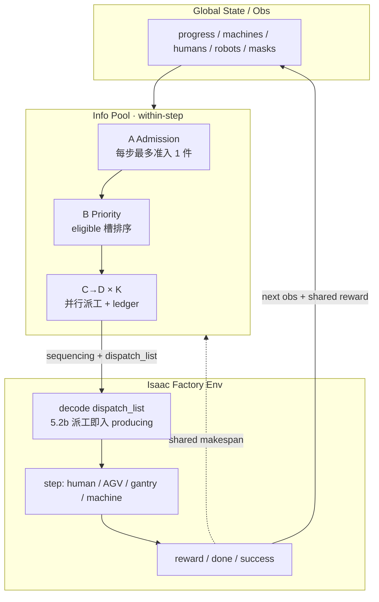
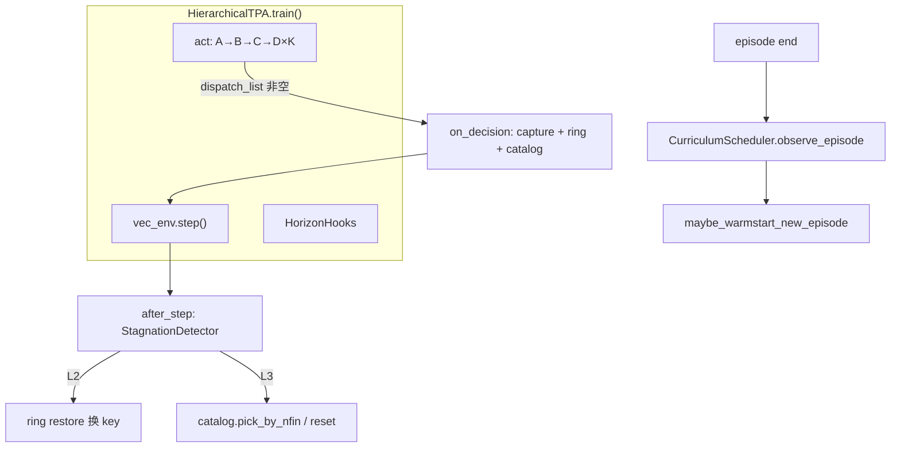

![[fig_env_cameras.png]]

# Isaac Factory · Hierarchical TPA

> **一句话**：面向**多任务并行生产**的 **Hierarchical** **任务规划与分配（TPA）**，优化 **makespan**。

相对旧作仅 **planning + allocation 两层**（规模小），现增加 **产品序列（A）与产品选择（B）**，以适配多件在制。

---

## 1. 系统结构（CTCE）

决策固定 **A → B → C → D**，共用全局状态；算法侧经 **信息池（info pool）** 更新 shadow mask / 资源占用后，写出 `dispatch_list` 给 env；仿真步进，反馈 next obs + **shared reward（makespan）**。集中训练、集中执行（**CTCE**）。



| 层   | 职责 | 输出 |
| --- | --- | --- |
| A | 每决策步最多准入 1 个新产品类型 | sequencing one-hot |
| B | 对 eligible 在制/staging 槽排优先级 | priority scores / 排序 |
| C | 按槽选下一 logistic / processing（mask） | task one-hot（每轮） |
| D | 派人；是否派 AGV（池内互斥） | human / robot alloc |
| Env | `dispatch_list` 批量解码；**5.2b** 派工即入 WIP | state, reward, done |

**并行度**：`max_parallel_cd_dispatch`（默认 1，上限 = eligible 槽数）；同一步内 C/D 循环时信息池维护 human/robot/gantry/**machine 工位 capacity**。


---


## 2. 核心主张与可打磨点

**核心 Idea**：一种面向**多任务并行生产**的 Hierarchical TPA 决策算法（A→B→C→D）。


| #   | 主张 / 现状                                                  | 相对旧作或缺口                          |
| --- | -------------------------------------------------------- | -------------------------------- |
| 1   | **主贡献**：planning + allocation 之上增加 **产品准入（A）与在制优先级（B）**，并支持 **同一步多槽并行派工（C/D×K）** | 旧两篇仅两层、单焦点；现可支撑多件在制并行            |
| 2   | 算法骨架：**CTCE + Masked DQN + 信息池 ledger**                               | 可升级：见下方 §2.1 与 [`docs/algo_optimization_roadmap.md`](docs/algo_optimization_roadmap.md) |
| 3   | 各层 **共享 Transformer-based obs encoder**                  | 网络侧仍可找增量点（表征、条件化）    |
| 4   | 节拍拉长后的 **超长时序训练**                                        | 稀疏回报、truncation、长 horizon 样本效率；见 **§5** 与 roadmap **L\*** |

### 2.1 算法可继续优化（摘要）

详细条目、优先级与落地顺序见 **[`docs/algo_optimization_roadmap.md`](docs/algo_optimization_roadmap.md)**（对照 Pateria HRL survey + 当前实现）。

| 档 | 方向 | 代表项 |
|----|------|--------|
| **P0** | 长时域数据闭环 | ORU 完整闭环（T1/T2）、progress-key 去冗、reverse curriculum |
| **P1** | 后端与样本 | Double DQN / Rainbow 组件、prioritized replay |
| **P1** | 层级学习 | B 层可学习 priority；A/B 在稀疏 makespan 下的信用分配 / 更新频率 |
| **P2** | 并行与产控接口 | 动态 K；A 与 WIP cap（CONWIP 式）联动 |
| **P2** | 表征 | 共享 vs 分塔 encoder；实体关系 / 疲劳条件化 |
| **叙事** | HRL 定位 | **Handcrafted** 生产四层 + pool，不写自动 option discovery；survey 只支撑长 horizon 抽象 |

与 §5（仿真吞吐 / checkpoint / curriculum）互补：§5 偏**系统与训练协议**，roadmap 偏**算法与学习目标**。

---


## 3. 实验设计


### 3.1 评价指标

Makespan、Success、Truncation；≥3–5 seeds；同环境、同 horizon。课程学习阶段另报 **completion_rate**、**normalized_makespan**（§5.5）。

### 3.2 Settings 矩阵（决策粒度 × 决策结构）

每步决策范围 × 架构（`K = max_parallel_cd_dispatch`）：


|                           | **K=1**（单派工 / 回归） | **K>1**（多槽并行派工） |
| ------------------------- | ---------------------- | ----------------------- |
| **Hierarchical**（A→B→C→D） | 基线口径；与旧焦点件行为对齐 | ★ **主设定**（信息池 + `dispatch_list`） |
| **One-stage / Flat**      | 代码保留，**非主对比** | 暂不做 |


另作正交轴：**有 Mask vs 无 Mask**（主方法默认有 Mask；无 Mask 作消融/对照）。

### 3.3 主对比（Hierarchical × 可调并行 K）

1. **Rule-based**（FIFO 优先级 + 信息池）
2. **Masked DQN（Hier A–D）** — 待优化；Flat **不进入主表**


### 3.4 Ablation（神经网络相关）

- 共享 Transformer encoder **vs** 各层独立 encoder  
- Encoder 深度 / 宽度（容量）  
- 有无 action mask  
- （可选）D 头：human/robot 分头 vs 联合头

---


## 4. Future work


### 近期（可快出）

1. **LLM-guided imitation for TPA**（示范 → BC / buffer 预热 → RL）
2. **迁移 / 扩域**：旧仿真迁移到新仿真代码，以及做transfer learning；或现仿真加工艺 / 产品
3. **Controllable long-term world model**（generative simulation）


### 中长期

1. Human realistic motion simulation
2. 海创 **deployment**  （CTCE结构会面临挑战）
3. **Fast simulation setup**：模型 + 工艺 + subtask → 快速搭仿真（AI Agent + Simulation）

---

## 5. 训练加速与长 Horizon 优化方案

> **动机**：单 episode 需产完 **16 件 × 6 道工序**，`max_episodic_steps=45000`；节拍拉长后 **makespan 稀疏**、**并发升高后 steps/min 下降**、**样本效率低**。下列方案分 **仿真吞吐**、**RL 训练**、**Checkpoint 与停滞恢复**、**课程学习** 四条线，可独立落地、组合使用。

### 5.1 仿真与训练吞吐（已部分落地）

| 手段 | 说明 | 状态 |
|------|------|------|
| **关闭相机 RTX 渲染** | 常规 `--headless` 训练不传 `--enable_cameras`；`step_env_physics` 仅在 `has_rtx_sensors()` 时 render | ✅ 已确认 / 已修 reset 误触发 render |
| **`learn_interval=8`** | 每 8 env step 做一次 DQN backward，降低 RL 算力占比 | ✅ `hier.yaml` |
| **存 buffer 与 learn 分离** | 每个**有效决策步**都 `store_pre`；仅 `global_step % learn_interval == 0` 时 backward | ✅ 已实现 |
| **preprocess 缓存** | 每步只 preprocess 一次 `s'`；`prev_pre` 下一步复用；`act` 路径 A/B/C/D 共享一份 `pre` | ✅ 已实现 |
| **idle agent 跳过** | `state=="free"` 的 human/robot 不跑 route/collision/animation | 待做 |
| **`parallel_producing_limit` 训练期下调** | 训练期 3–5 vs 全量 10，减轻并发负载 | 配置项，待定稿 |

**有效决策步过滤**（buffer 只存有意义 transition）：

- 全局：`_had_meaningful_decision` — `dispatch_list` 非空或 `product_sequencing.sum()>0`
- 各层：A/B/C action 非零；D 在 C≠no-op 且 human/robot 非零时分别存入

### 5.2 Checkpoint：reset 到指定状态（非 t=0）

**目标**：Debug 复现、warm-start 跳过冷启动、停滞后回到最近决策点而非整局重开。

#### `env_state_action_dict` 能否复原环境？

| 类别 | 内容 | 可序列化？ |
|------|------|------------|
| **逻辑 MDP** | `progress`（订单/WIP/finished/`ongoing_task_records`）、human/robot/machine/material/storage 状态 | ✅ |
| **物理写回** | `articulations.joint_position`、`rigid_prims` 位姿 | ✅（经 `apply_data_to_sim`） |
| **运行时句柄** | `articulations/rigid_prims["object"]`（Articulation/RigidPrim） | ❌ strip 后 restore 时 rebind |
| **需重算或扩展** | `generated_route`（可清空后由 area_id 重算）、gantry 动画内部量、human 骨骼动画 | ⚠️ 部分 |

**建议 API**（已实现，见 `src/env_checkpoint.py`）：

```text
capture(env_dict)           → CPU snapshot（strip object / generated_route）
restore(single_env, ckpt)   → rebind manager.state + apply_data_to_sim + refresh mask
progress_key(env)           → 8 字符 SHA1，决策等价 WIP 主键
restore_checkpoint(ckpt)    → hc_single_env_base 对 restore 的薄封装
```

**有效决策 checkpoint**：`dispatch_list` 非空（`HorizonHooks.on_decision` 触发）。采集时按 **progress key 精确去重** 入库（§5.4）；在线 L2 用 ring buffer（K=20）换 **未试过的 key** 再 restore。

### 5.3 Progress 停滞检测与分级恢复

**已实现**（`src/stagnation.py` + `horizon_hooks.py`）：以 `debug_env_dump.ongoing_fingerprint` 为唯一停滞信号——ongoing 槽的 `(task, ongoing_index, ongoing, finished, gantry_zone, outbound…)` 拼接串；**连续 N 步 fp 不变**则升级。

| 级别 | 阈值 | 动作（代码） |
|------|------|--------------|
| L1 | 400 步 | 打印日志 |
| L2 | 600 步 | ring buffer restore：跳过 `key==当前` 或 `key∈tried_keys`，换最近/最早未试 key |
| L3 | 800 步 | 优先 `catalog.pick_by_nfin(n_finished)`；否则 ring（oldest）；否则 full reset + warmstart |

**设计预留、未接线**：`finished_count_unchanged`、`no_meaningful_decision` 独立信号；restore 步负 reward / `truncated_soft` 标记。

### 5.4 随机探索采集库（暂不用 Rule）

**目标**：在 **全量 16 件** 上用 **masked random**（Hier，`epsilon=1`，合法动作均匀采样）滚出一条尽量长的轨迹；死锁则回退到最近关键决策点再试；多轮追加、按进度去重。产出供后续课程训练 `--warmstart` 读取。

暂不跑 rule_based；不按 1/2/4/8 分段采集，只采 N=16。课程训练时从该库里 **按 `n_finished` / progress key 切片** 取出「相当于 1 件已完成」等子集。

#### 死锁 → 回退再探索

采集循环（同一条 16 件 episode 上可多次）：

```text
step → 若 meaningful decision 且 progress 足够新 → 入库
     → 若 L2/L3 停滞 / deadlock
           restore 最近一条已入库关键点（优先 n_finished 更高、同 key 不重复试）
           换 RNG / 重采样合法动作继续
     → 若 T_max 或整局 success → 结束本 round，catalog 落盘
```

**多轮更新**：round r+1 读已有 `catalog.jsonl`，可从 t=0 或从库中某个 ckpt 续跑；只 **append 新 key**（或同 key 更优：`n_finished` 更高 / 距死锁更远）。不覆盖旧 round 文件。

#### 状态相似度（去重 / 近邻检索）

**原则**：不用物理位姿或 `time_step`——同一 WIP 下人在路上走两步，几何差很大，决策等价。

| 层 | 定义 | 代码状态 | 用途 |
|----|------|----------|------|
| **Progress key（精确）** | JSON → SHA1 前 8 位；字段见 §9.2 | ✅ `progress_key()` | 采库去重；L2 换 key |
| **ongoing_fingerprint** | 各 ongoing 槽细粒度串 | ✅ `ongoing_fingerprint()` | 停滞检测；嵌入 progress_key 的 `fp` 字段 |
| **Soft cosine（近似）** | `preprocess_for_buffer` 展平后 cosine，跳过 `time_norm` / `route_progress` / `subtask_time_counter` | ⚠️ `soft_cosine()` 已实现，`soft_cosine_th=0.95` 已读入配置，**未接入回退链** | 设计：精确 key 试尽后的近邻 restore |
| **Key Hamming/Jaccard** | progress key 字段加权距离 | ❌ 未实现 | 设计备选 |
| **Encoder embedding** | 网络表征 cosine | ❌ 未做 | 需训稳后 |

**Progress key  payload**（`env_checkpoint.progress_key`）：

```text
nfin          — 已完成件数
slots[]       — 各在制槽: product:task:ongoing_index:finished_subtask_bitmask
left[]        — not_started 剩余订单 (product, count)
next          — next_product 候补
h / r / m     — 非 free 的人 / 机器人 / 机床名字（不含 route_index）
fp            — ongoing_fingerprint
→ SHA1[:8]
```

**入库规则**（`ExploreCatalog.save_if_new`）：key 已存在且旧行 `n_finished ≥ 新` → 拒收；否则 append + 更新 `by_nfin/` 硬链。

**L2 回退规则**（`_restore_ring`）：从新到旧扫 ring；跳过当前 key 与 `StagnationDetector.tried_keys`；选中后 restore 并记入 tried_keys。

**L3 catalog 检索**（`pick_by_nfin`）：精确匹配 `n_finished`；无则取 **不超过目标的最大 nfin**——不是相似度检索。

#### 目录命名

```text
env_checkpoints/random_explore/
  N16_T25000/                    # 件数 + 采集用 T_max
    catalog.jsonl                # 一行一条：key, path, n_finished, t, round, deadlock_child
    rounds/
      r001/
        meta.json                # seed, epsilon=1, T_max, 起始 ckpt
        ckpts/
          nfin00_ong01_t000421_{key8}.pkl
          nfin01_ong02_t003102_{key8}.pkl
      r002/                      # 续跑，只追加新 key
    by_nfin/                     # 硬链或索引，训练按完成件数取
      00/  01/  …  16/
```

文件名：`nfin{完成件数}_ong{在制槽数}_t{time_step}_{key8}.pkl`。`catalog.jsonl` 是唯一检索入口。

**不存**：`object` 句柄、整条 `generated_route`、`camera/perception`。

| Tier | 内容 | 用途 |
|------|------|------|
| **A 环境 ckpt** | 上表 pkl + catalog | `--warmstart` / 死锁回退 |
| **B 决策轨迹** | 可选：同步 `pre/action/mask` | 以后 BC / 回归 |
| **C Debug JSON** | 仅 L3 死锁样本 | 复现 |

### 5.5 课程学习：只先做「增加产品数」

两条轴，**现阶段只做轴 1**。

| 轴 | 内容 | 状态 |
|----|------|------|
| **1 产品件数** | 1 → 2 → 4 → 8 → 16，从随机探索库按 `n_finished` 切片 warmstart | **现在做** |
| **2 时间尺度** | 缩短 `CfgSubtaskPredefinedTimeGallery` 固定节拍，和/或人/AGV 移动耗时 | **先不做**；做之前必须验证物理/动画仍稳定，并按同一 `α` 缩放 `T_max` |

`go_to_*` 在 gallery 里是 `None`，时长由 **路径长度 / 速度** 决定，不是固定步数。轴 2 若开，要同时乘：`control_machine` 等固定项、人/机器人速度（或路径分辨率）、以及下面的 `T_max`。

#### Horizon 与并发随 N 绑定

以全量 **N=16、`T_max=25000`** 为锚（当前工业节拍、`α=1`）：

```text
T_max(N) = round(25000 * N / 16)     # 1→1563, 2→3125, 4→6250, 8→12500, 16→25000
# 轴 2 启用后：
T_max(N, α) = round(25000 * N / 16 * α)
```

| Stage | 目标件数 N | `stage_wip_cap` | `T_max`（精确） | 初始状态 |
|-------|------------|-----------------|-----------------|----------|
| 0 | 1 | 2 | 1563 | 冷启动或库 `nfin=0` |
| 1 | 2 | 3 | 3125 | catalog `nfin≥1` |
| 2 | 4 | 4 | 6250 | `nfin≥2` |
| 3 | 8 | 6 | 12500 | `nfin≥4` |
| 4 | 16 | 10 | 25000 | `nfin≥8` |

`T_max(N) = round(25000 × N / 16)`（`curriculum.t_max_for`）。**Encoder 输入维固定 10**；`stage_wip_cap` 只作运行时 A/B 准入与在制上限（`wip_cap()` → masker / info pool），不改网络结构。

**升阶**：最近 20 ep `success_rate≥0.7` 且 `stagnation_rate<0.2` 且 `normalized_makespan<1.2`。

#### 指标设计（makespan 不可跨 stage 直接比）

| 指标 | 定义 |
|------|------|
| **completion_rate** | `n_finished / target_products` |
| **normalized_makespan** | `ep_len / T_max(N)`（暂无 rule 中位标定；有稳定成功 ep 后再换 `T_ref`） |
| **products_per_1k_steps** | `1000 × n_finished / ep_len` |
| **stagnation_resets / ep** | 停滞恢复次数 |
| **effective_steps_ratio** | `(ep_len - stagnation_steps) / ep_len` |

WandB：`Curriculum/stage`、`Metrics/completion_rate`、`Metrics/normalized_makespan`、`Stagnation/resets_per_episode`。

#### Reward 随 stage 缩放

当前：`reward = -step_penalty + finish_bonus·Δfinished + task_bonus·Δtask + success_bonus·(1 - t/T_max)`（success 时）。

**问题**：16 件时 success 项极小，1 件时很大 → 跨 stage 不可比。

**建议**：

- `T_max`、`success_bonus` **按 stage 配置**绑定；
- success 项用 **stage 内剩余进度**：`(t - t_start) / (T_stage - t_start)`；
- 或改为 **每完成 1 件给固定 bonus**，episode 完成 stage 目标再给 `B_stage`；
- 主对比看 **normalized_makespan / completion_rate**，不单看 raw ep_return。

### 5.6 实施顺序

```text
Phase 1  capture/restore + StagnationDetector + progress_key     ✅ 8.18
Phase 2  随机探索采集（N=16, ε=1）+ 死锁回退 + catalog 多轮     ✅ 8.18
Phase 3  CurriculumScheduler + catalog 切片 warmstart + wandb   ✅ 8.18
Phase 4  soft_cosine 近邻回退 / idle 跳过 / restore 信用标记     待做
（轴 2 时间尺度：验证后再做，T_max *= α）
```

**训练入口**：`train.py` CLI + `batch_train.sh` 22–26（§9.5）。细节见 **§9 实现总结**。

---

## 6. 本周进展（8.18）

> **更新**：8.18–8.23 增量见 **§10**；8.23 组会口径见 **§11**。

### 6.1 仿真与基线

1. **Hierarchical RL 已开训**；`--algo hier` / `rule_based` /（代码保留）`flat`。
2. **并行 CD 决策落地**：信息池 + `dispatch_list` + **5.2b（派工即入 producing）**；A 每步最多准入 1 件；B = FIFO 优先级；`max_parallel_cd_dispatch` 可调。
3. **AGV**：logistic + processing 转运 / 卸料；龙门 2→4、AGV 2→4（片区装卸 + 跨区运输）。
4. **加工时长**按工业节拍加长 → 默认 `max_episodic_steps=45000`（无 `--curriculum` 时）。
5. Bug：龙门架间距死锁已修；评测 `--test`（Makespan / Success / Truncation，多 seed）。

### 6.2 训练吞吐

6. headless **无相机 RTX 渲染**；reset 不再误触发 render。
7. `learn_interval=8`；buffer **store / learn 分离**；preprocess 每步单次 + act 共享 `pre`（§5.1）。

### 6.3 长 Horizon 落地（Phase 1–3）

8. **`env_checkpoint.py`**：`capture` / `restore` / `progress_key` / `wip_cap`；manager.state rebind。
9. **`stagnation.py`** + **`horizon_hooks.py`**：L1/L2/L3 + ring buffer + catalog 回退。
10. **`explore_catalog.py`** + `--explore`：N=16、ε=1、masked random 采库、多 round append。
11. **`curriculum.py`** + `--curriculum`：件数轴 1→16、`T_max(N)`、`stage_wip_cap`、catalog 切片 warmstart。
12. **`train.py`** 新 flag：`--explore` / `--curriculum` / `--warmstart`；进程名 `HcFactory-<algo>-xjt`（`setproctitle`）。
13. **`batch_train.sh`**：25 explore / 26 curriculum / **D 组主路径**；24 全量硬训对照。
14. **日志**：`step=` 与 wandb `Train/step` = **vector 拍 × num_envs**；`ep_t` 仍为单局 `time_step`；`steps/min` 同步加总；checkpoint 文件名仍用 vector 拍。
15. **监控**：`tools/monitor_training.py` 默认匹配 `HcFactory-`（避免误匹配 `train.py` 自身）。

### 6.4 待做

- soft cosine 近邻回退接线；idle agent 跳过；restore 步 RL 信用标记；时间尺度轴 α。

---

## 7. 代码改动清单

> 对照 §3；主对比为 **Rule vs Hier**，Flat 非主表。训练加速与长 horizon 见 **§5**。

### 7.0 已完成

- [x] Hierarchical A→B→C→D（`HierarchicalTPA`，`--algo hier`）
- [x] 共享 `HierObsEncoder` + 各层 Masked DQN
- [x] `AlgoHierarchicalMasker` + **信息池 ledger**（human/robot/gantry/**machine 工位**）
- [x] **`dispatch_list` + 5.2b**（`task_progress_manager`）；`tpa_info_pool.py` / `hierarchical_dispatch.py`
- [x] Rule-based 走同一并行流水线（`agent_B_product_priority`，FIFO）
- [x] `max_parallel_cd_dispatch`（`hier.yaml` / `rule_based.yaml`）
- [x] `--test` 评测协议（`tpa_eval.py`）；makespan / success / truncation 日志
- [x] Flat 代码路径保留（`--algo flat`），**主实验不跑**
- [x] **`learn_interval=8`**；buffer **store / learn 分离**（`hierarchical_tpa.py`、`hier_rl_agents.py`）
- [x] **preprocess 优化**：train loop `prev_pre` 复用 + act 共享 `pre`（`hier_obs.py`、`hierarchical_dispatch.py`）
- [x] headless 训练 **无相机渲染**；`hc_vector_env_base` reset 不再误用 `has_registered_cameras()` 触发 render
- [x] **`env_checkpoint.py`** + **`StagnationDetector`** + progress key 去重
- [x] **随机探索采集器**（`--explore`，N=16、ε=1）+ catalog 多轮 append
- [x] **`CurriculumScheduler`**（`--curriculum`）+ `T_max(N)` + `--warmstart`
- [x] **`batch_train.sh`**：22–24 Rule/Hier 对照；**25 explore / 26 curriculum / D 组主路径**
- [x] 日志 **`step=` = vector 拍 × num_envs**（`ep_t` 仍为单局步数）；checkpoint 文件名仍用 vector 拍

### 7.1 P0 — 主对比实验（§3.3）

**1. Hier 训练稳定性**
- `hier.yaml` 超参定稿；B 从 FIFO → **per-slot scalar Q**；K>1 时 C/D 多 transition
- checkpoint load/resume；可选 Prioritized Replay / n-step

**2. 主表实验矩阵**
- Rule vs Hier × `K∈{1,2,…}` × ≥3–5 seeds → Makespan / Success / Truncation
- `batch_train.sh`：**C 组** Rule/Hier 对照；**D 组** explore→curriculum 主路径（25/26）

**3. 评测固化**
- wandb rolling Success / Truncation；统一 JSON 输出目录约定
- **归一化指标**：`completion_rate`、`normalized_makespan`（§5.5）

### 7.2 P1 — 训练加速与 Checkpoint（§5.2–5.4）

| # | 改动 | 要点 | 状态 |
|---|------|------|------|
| 10 | **`env_checkpoint.py`** | `capture_checkpoint` / `restore_checkpoint`；strip `object`；rebind + `apply_data_to_sim` | ✅ |
| 11 | **`StagnationDetector`** | 复用 `ongoing_fingerprint`；L1/L2/L3；死锁 → restore 最近关键点 | ✅ |
| 12 | **progress key + 去重** | 逻辑 WIP 主键；精确 key 去重 + L2 换 key | ✅ |
| 12b | **soft cosine 近邻** | `soft_cosine()` 已实现，回退链未接线 | ⚠️ 预留 |
| 13 | **随机探索采集器** | N=16、ε=1、masked random；多 round append；`catalog.jsonl` + `nfin*_ong*_t*_{key}.pkl` | ✅ `./batch_train.sh 25` |
| 14 | **idle agent 跳过** | free human/robot 不跑 route / animation | 待做 |

### 7.3 P1 — 课程学习（§5.5）

| # | 改动 | 要点 | 状态 |
|---|------|------|------|
| 15 | **`CurriculumScheduler`** | 只做件数轴 1→16；从 catalog 按 `n_finished` 切片 warmstart | ✅ `./batch_train.sh 26` |
| 16 | **`T_max(N)` 绑定** | `25000 * N / 16`；同步 `CfgProductOrder`、`parallel_limit`、success 分母 | ✅ |
| 17 | **wandb curriculum 指标** | `Curriculum/stage`、`normalized_makespan`、`stagnation_resets` | ✅ |

### 7.4 P2 — 消融（§3.4）

| # | 改动 | 要点 |
|---|------|------|
| 4 | **Mask 开关** | Hier+Mask vs Hier-NoMask |
| 5 | **共享 vs 独立 Encoder** | `encoder_mode: shared \| independent` |
| 6 | **Encoder 容量** | `state_dim` / layers / `hidden_dim` |
| 7 | **Partial hierarchy** | 各层 `rule \| rl` |
| 8 | **D 头** | `split \| joint` |
| 9 | **K / 5.2b 消融** | K=1 vs K>1；对比旧延迟入列语义（若需 ablation） |

### 7.5 P3 — 规模 / 辅线

**18. 规模扫描**：`parallel_producing_limit`、产品件数、human/AGV 数  
**19. Reward / AGV 消融**  
**20. LLM / Rule warm-start**（与 §5.4 Tier B 衔接）  
**21. Flat（可选压力测，非主表）**

### 7.6 建议实施顺序

```
随机探索采集 N=16（ε=1，死锁回退）→ catalog 多轮
→ Curriculum 按 N 改 T_max / 订单（从 catalog 切片）
→ Hier 训稳 + Rule/Hier × K 扫描（Rule 仍作评测基线，暂不用于采库）
→ Mask / Encoder 消融 → 规模扫描
→（以后）时间尺度 α + T_max *= α
```

### 7.7 主要文件

| 模块 | 文件 |
|------|------|
| 信息池 / 派工 | `tpa_info_pool.py`、`hierarchical_dispatch.py` |
| Env decode | `task_progress_manager.py` |
| Rule / Hier | `rule_based.py`、`hierarchical_tpa.py`、`hier_rl_agents.py` |
| Obs / preprocess | `hier_obs.py`、`data_preprocess_for_buffer.py` |
| 停滞 debug | `debug_env_dump.py`（`ongoing_fingerprint`） |
| Checkpoint / 采集库 | `src/env_checkpoint.py`、`src/stagnation.py`、`src/explore_catalog.py`、`src/curriculum.py`；`horizon_hooks.py`；目录 `env_checkpoints/random_explore/` |
| 配置 | `hier.yaml`、`rule_based.yaml` |
| 批训练 / CLI | `batch_train.sh`（**22–29**、C/D 组）；`train.py --explore/--curriculum/--warmstart/--explore_n_products` |
| Horizon 接线 | `horizon_hooks.py` ← `hierarchical_tpa.train()` |
| 监控 | `tools/monitor_training.py`（默认 `HcFactory-`） |
| 评测 | `tpa_eval.py`、`train.py --test` |

---

## 8. 8.18 组会

### 1. 问题与方法

- **故事不变**：前两篇只有 task planning + allocation，决策焦点落在单件产品上，对不上大规模并行生产。本篇解决的是 **多件在制并行**。
- **结构从多智能体改为分层**：A 决定本步是否准入一件新产品；B 维护在制优先级，并维护状态信息池；C/D 按优先级对每件产品做原来的 TPA。每次派工先回写信息池，再服务下一件，从而 **同一步可连续派 K 件**，而不是一步只服务一件。这样算法上限更高，后续才有机会扩规模。
- **A 与 BCD 的时序**（同一步内立刻可见）：
  - A 选出产品 → 信息池写入 `next_product`（候补槽），B 立刻可将其排进优先级，C/D 立刻可对其派工。
  - 写入 `producing` 发生在 **C/D 成功派工** 时（5.2b：派工即入在制）。若本步未派到，产品停在候补槽，尚未进入在制列表。

### 2. 仿真改动

- 龙门：2 → **4**，只负责片区装卸。
- 跨区运输改由 AGV；AGV：2 → **4**。
- 目的：提高并行负载上限，避免两个龙门成为瓶颈。

### 3. 训练挑战

- 16 件完整 episode 约 **2 万步**；后期吞吐约 **100 steps/min**（当前 `num_envs=1`）→ 一轮约 3–5 小时。
- 日志里的 `steps/min` 按 **加总** 计：`global_step × num_envs / 墙钟分钟`。`num_envs=1` 时与 vector 拍数相同；`num_envs=K` 时 100 拍/分会显示为 **100K**。单局仍要走满约 2 万拍，墙钟不一定变短（vector env 净收益待测）。
- 存在仿真后程，死锁的问题，但又不好debug
- **Vector env 是否真能加速：待测试。** 多环境会摊学习、增加样本，但 Isaac 同进程仿真可能把单步变慢，净收益不确定。
- 稀疏回报 + 超长 horizon + 并发升高后仿真变慢，直接从零硬训全量不现实。

### 4. 训练方案

#### 4.1 采集：16 件 masked random（暂不用 Rule）

- 设定：Hier，`epsilon=1`，在合法 mask 上均匀采样；只跑 **N=16**。
- 关键决策点：`meaningful decision` 且 dispatch 写入 `ongoing_task_records` 时存档。
- **死锁回退**：ongoing 指纹连续不变（L2≈600 步 / L3≈800 步）→ restore 最近已入库关键点，换 RNG 继续，不整局重开。
- **去重（状态相似度）**：不用位姿 / `time_step`。
  - **Progress key（主键）**：`n_finished` + 各槽 `(product, task, ongoing_index, finished_subtask)` + 剩余订单 + 占用的人/车/机身份。key 相同不存。
  - **Soft 距离**：key 的 Hamming/Jaccard，或 `preprocess_for_buffer` 去掉时间与路径进度后的 cosine；仅用于回退近邻（cosine>0.95 且 `n_finished` 相同视为近重复）。
- **多轮追加**：round r+1 读 `catalog.jsonl`，从 t=0 或已有 ckpt 续跑；只 append 新 key（或同 key 更优：完成件数更高 / 距死锁更远），不覆盖旧文件。
- 目录：

```text
env_checkpoints/random_explore/N16_T25000/
  catalog.jsonl
  rounds/r001/ckpts/nfin01_ong02_t003102_{key8}.pkl
  by_nfin/00/ … /16/
```

训练时按 `n_finished` 切片取 warmstart，不按 1/2/4/8 分段采集。

#### 4.2 课程：只先加产品件数（缩短节拍先不做）

- **轴 1（现在做）**：订单 1 → 2 → 4 → 8 → 16，从采集库按 `n_finished` 切片起步。
- **轴 2（先不做）**：缩短 `CfgSubtaskPredefinedTimeGallery`（如 `control_machine=100`）或人/AGV 移动耗时。`go_to_*` 时长由路径/速度决定，不是表内固定步。以后若做，固定节拍、移动速度、`T_max` 须乘同一 `α`，并先验仿真稳定性。

Horizon 以 N=16、`T_max=25000` 为锚，随件数绑定：

```text
T_max(N) = 25000 * N / 16
# 轴 2 以后：T_max(N, α) = 25000 * N / 16 * α
```

| Stage | N | `stage_wip_cap` | `T_max` | 起点 |
|-------|---|-----------------|---------|------|
| 0 | 1 | 2 | 1563 | 冷启动或 `nfin=0` |
| 1 | 2 | 3 | 3125 | catalog `nfin≥1` |
| 2 | 4 | 4 | 6250 | `nfin≥2` |
| 3 | 8 | 6 | 12500 | `nfin≥4` |
| 4 | 16 | 10 | 25000 | `nfin≥8` |

同步改：`CfgProductOrder`、`max_episodic_steps`、`parallel_producing_limit`、success 项的 `T_max` 分母。评测 horizon 与该 stage 一致。

升阶（最近 20 ep）：`success_rate≥0.7` 且 `stagnation_rate<0.2` 且 `normalized_makespan<1.2`。跨 stage 主看 `completion_rate`、`normalized_makespan=ep_len/T_max(N)`，不单看 raw return。

#### 4.3 实施顺序

1. `capture/restore` + 停滞检测 + progress key — ✅  
2. N=16 随机采集 + 死锁回退 + catalog 多轮 — ✅  
3. 按 N 调度课程 + 切片 warmstart — ✅  
4. soft cosine 近邻 / idle 跳过 / restore 信用 — 待做  
5. （以后）时间尺度 `α`，`T_max *= α`

完整代码对照见 **§9**。

#### 4.4 操作步骤（`batch_train.sh`）

前置：conda `isaac-lab`，仓库根目录，**不要**开 `--enable_cameras`。当前录像把 gallery 固定节拍改成了 5，采库/课程前若要对齐工业节拍，先改回 `25/100`。日志 `step=` = **vector 拍 × num_envs**（`ep_t` 为单局步数）。

| 序号 | 命令 | 说明 |
|------|------|------|
| **24** | `./batch_train.sh 24 cuda:0` | 可选对照：16 件 / yaml `max_episodic_steps=45000`、无课程 |
| **25** | `./batch_train.sh 25 cuda:0` | Step 1 采集库：`--explore`，N=16，T_max=25000，ε=1 |
| **26** | `./batch_train.sh 26 cuda:0` | Step 2 课程训练：`--curriculum`，1→16 件，wandb |
| **D** | `./batch_train.sh D cuda:0` | 主路径：25 → 26 依次跑 |
| **C** | `./batch_train.sh C cuda:0` | Rule/Hier 对照：22 → 23 → 24 |

续采 / 指定 warmstart（25、26 均支持）：

```bash
HC_WARMSTART=env_checkpoints/random_explore/N16_T25000/rounds/r001/ckpts/nfin01_....pkl \
  ./batch_train.sh 25 cuda:0
```

**Step 1 — 采集库（25 / `--explore`）**  
Hier，`epsilon=1`，不 DQN backward；有效派工按 progress key 去重写入 catalog；L2/L3 死锁回退。多跑 `./batch_train.sh 25` = 多 round，只 append。

产出：

```text
env_checkpoints/random_explore/N16_T25000/
  catalog.jsonl
  rounds/r001/ckpts/nfinXX_ongYY_tTTTTTT_{key8}.pkl
  by_nfin/00/ … /16/
```

停的条件：`by_nfin` 里中高完成件数有若干不重复 key（不必一次 success 完全局）。

**Step 2 — 课程训练（26 / `--curriculum`）**  
从 stage 0（1 件，`T_max=1563`，`wip_cap=2`）升到 stage 4（16 件，25000）。升阶：最近 20 ep `success≥0.7` 且停滞率 `<0.2` 且 `ep_len/T_max<1.2`。stage>0 时从 catalog 按 `n_finished` 切片 restore。Encoder 维仍为 10。未加 `--curriculum` 时不改 yaml 的 45k horizon。

```bash
python train.py --task HRTPaHC-v1 --algo hier --headless --test \
  --load_dir <run_dir> --load_name <exp>
```

WandB：`Curriculum/stage`、`Metrics/completion_rate`、`Metrics/normalized_makespan`、`Stagnation/resets_per_episode`。

---

## 9. 实现总结：设计与代码对照（8.18）

> 本节汇总 **8.18 已落地** 的全部改动，作为 §5 设计方案与源码的一页式索引。组会口径见 §8；操作命令见 §8.4.4。

### 9.1 训练流水线总览



| 模式 | 触发 | 行为差异 |
|------|------|----------|
| **默认** | 无 flag | yaml `max_episodic_steps=45000`；HorizonHooks 不启 explore/curriculum |
| **`--explore`** | `batch_train.sh 25` | ε=1；**无 DQN backward**；T_max=25000；采库 append |
| **`--curriculum`** | `batch_train.sh 26` | 按 stage 改 N / T_max / wip_cap；stage>0 catalog warmstart |
| **`--warmstart <pkl>`** | 25/26 可选 | bind 时 restore；课程模式 overlay 订单 |

接线点：`hierarchical_tpa.py` 构造 `HorizonHooks(config)`；train loop 内 `on_decision` / `after_step` / `on_episode_end`。

### 9.2 Checkpoint（`src/env_checkpoint.py`）

| 函数 | 作用 |
|------|------|
| `capture(env)` | 深拷贝 logic state + 关节/刚体位姿；strip `object`、`generated_route` |
| `restore(single_env, ckpt)` | merge → 清 route → rebind manager.state → `apply_data_to_sim` → refresh mask |
| `progress_key(env)` | 决策等价 WIP → SHA1[:8]（字段见 §5.4） |
| `wip_cap(progress)` | 读 `stage_wip_cap`，默认 10；供 masker / info pool 限在制 |
| `soft_cosine(pre_a, pre_b)` | preprocess cosine（跳过时间/路径维）；**未接入回退** |
| `n_finished(env)` | 统计 `progress.finished` 总件数 |

**Restore 限制**（capture 注释）：human 动画 / gantry PoseAnimation 时钟不能完美回放；restore 后 joint 位姿 snap，route 由 area_id 重算。

**Env 封装**：`hc_single_env_base.restore_checkpoint(ckpt)` → `restore(self, ckpt)`。

### 9.3 停滞检测（`src/stagnation.py`）

- 信号：`ongoing_fingerprint(env)` 逐步比较。
- fp 变化 → `n=0`，清空 `_fired` / `tried_keys`。
- fp 不变 → `n++`；达 L1/L2/L3 阈值各触发一次（同一段停滞不重复 L2）。
- L2 restore 后：`det.reset()` 但 **保留 tried_keys**，避免反复 restore 同一 key。

阈值默认（`hier.yaml`）：400 / 600 / 800；ring 长度 K=20（`decision_ring_k`）。

### 9.4 采集库（`src/explore_catalog.py`）

**目录**：

```text
env_checkpoints/random_explore/N16_T25000/
  catalog.jsonl          # 追加式索引：key, path, n_finished, n_ongoing, t, round
  rounds/r001/
    meta.json            # epsilon, t_max, ts
    ckpts/nfinXX_ongYY_tTTTTTT_{key8}.pkl
  by_nfin/00/ … /16/     # 硬链（失败则 symlink）
```

**多 round**：每次 `--explore` 新建 `r00N/`；读已有 `catalog.jsonl` 加载 `_by_key`；只 append 新 key 或更高 `n_finished` 的同 key。

**explore 模式训练侧**：`hierarchical_tpa` 强制 ε=1、跳过 `learn()`；`stage_wip_cap=10`（全量在制上限）。

### 9.5 课程学习（`src/curriculum.py`）

**Stage 表**（`STAGES` + `t_max_for`）：

| stage | N | wip_cap | T_max |
|-------|---|---------|-------|
| 0 | 1 | 2 | 1563 |
| 1 | 2 | 3 | 3125 |
| 2 | 4 | 4 | 6250 |
| 3 | 8 | 6 | 12500 |
| 4 | 16 | 10 | 25000 |

**`CurriculumScheduler.apply(env)`** 写入：
- `task_manager.max_episodic_steps = T_max(stage)`
- `progress.stage_wip_cap`、`progress.curriculum_stage`
- `progress.product_order`、`progress.not_started`（`overlay_existing=True` 时按已完成/在制重算 leftover）

**升阶**（`observe_episode`）：最近 20 ep 滑动窗；`success_rate≥0.7` 且 `stagnation_rate<0.2` 且 `mean(ep_len/T_max)<1.2` → stage+1。

**新 episode warmstart**：stage>0 时 `start_nfin = N/2`，`catalog.pick_by_nfin(start_nfin)` → restore → overlay 订单。

**A/B 受 wip_cap 约束**（`algo_hierarchical_masker.py` + `tpa_info_pool.py`）：准入与在制计数读 `wip_cap(progress)`，encoder 维仍 10。

### 9.6 CLI 与批训练

**`train.py` 新增参数**：

| Flag | 写入 config | 说明 |
|------|-------------|------|
| `--explore` | `explore`, `explore_catalog` | 采库模式 |
| `--curriculum` | `curriculum` | 件数课程 |
| `--warmstart PATH` | `warmstart` | Tier-A pkl |
| `--max_sim_episodes N` | rule 短跑 | 22/23 用 |

进程名：`setproctitle` → `HcFactory-<algo>-xjt cuda:N`（nvidia-smi / monitor 可见）。

**`batch_train.sh` 序号**：

| # | 命令 | 内容 |
|---|------|------|
| 22 | `./batch_train.sh 22` | rule K=1，10 ep |
| 23 | `./batch_train.sh 23` | rule K=10，10 ep |
| 24 | `./batch_train.sh 24` | hier 全量硬训 45k（对照） |
| 25 | `./batch_train.sh 25` | explore 采库 |
| 26 | `./batch_train.sh 26` | curriculum 训练 |
| C | `./batch_train.sh C` | 22→23→24 |
| D | `./batch_train.sh D` | **25→26 主路径** |

`HC_WARMSTART=/path/to.pkl ./batch_train.sh 25` 续采或指定起点。

**`.gitignore`**：`/env_checkpoints/`（本地 catalog，不入库）。

### 9.7 日志与监控约定

| 量 | 定义 | 用途 |
|----|------|------|
| `global_step` | 每次 `vec_env.step()` +1 | checkpoint 文件名、save_interval |
| `env_steps` | `global_step × num_envs` | 日志 `step=`、wandb `Train/step` |
| `ep_t` | 单 env 的 `time_step` | 单局进度；与 `step=` 并存 |
| `steps/min` | `env_steps / 墙钟分钟` | 吞吐；多 env 时加总 |

实现：`hier_utils.env_steps` / `steps_per_min`；hier / rule / flat 均已对齐。

**监控**：`python tools/monitor_training.py --match HcFactory-hier`（默认 `HcFactory-`）。

### 9.8 其它代码触达点

| 文件 | 改动要点 |
|------|----------|
| `hc_single_env_base.py` | `restore_checkpoint()` |
| `task_progress_manager.py` | reset 时保留已有 `stage_wip_cap` |
| `algo_hierarchical_masker.py` | A/B mask 读 `wip_cap()` |
| `tpa_info_pool.py` | 在制上限 `wip_cap(progress, parallel_producing_limit)` |
| `hier.yaml` | explore/curriculum/stagnation/decision_ring_k 默认项 |
| `horizon_hooks.py` | explore / curriculum / stagnation / catalog 总控 |

### 9.9 设计 vs 实现差距（Phase 4）

| 项 | 设计 | 现状 |
|----|------|------|
| soft cosine 近邻回退 | L2 key 试尽后按 cosine≥0.95 restore | 函数有，**未调用** |
| Key Hamming/Jaccard | 字段级近似 | 未实现 |
| idle agent 跳过 | free 人不跑 route/animation | 未做 |
| restore 信用标记 | 小负 reward / truncated_soft | 未做 |
| Tier B 决策轨迹 | 同步 pre/action/mask | 未做 |
| 时间尺度轴 α | gallery / 速度 / T_max 同缩放 | 刻意不做 |

### 9.10 推荐实验顺序

```text
1. ./batch_train.sh 25（多跑几轮，丰富 catalog by_nfin）
2. ./batch_train.sh 26 或 ./batch_train.sh D
3. 必要时 ./batch_train.sh 24 作全量硬训对照
4. --test 评测；Rule 仅作基线，不参与采库
```

**节拍注意**：当前录像可能把 `CfgSubtaskPredefinedTimeGallery` 固定项改成 5；正式采库/课程前若要对齐工业节拍，改回 `25/100`。

---

## 10. 本周进展（8.18–8.23）

> **组会口径**：相对 8.18 落地 Phase 1–3 后，本周完成 **指标统一、训练/评测 horizon 拆分、倒序课程、DQN 稳定化与基线矩阵扩展**；26 号长训已出初步结果（makespan 横盘、~2M 步后 loss 发散），已改配置待重跑。

### 10.1 训练 / 评测 Horizon（重要变更）

| 量 | 旧默认 | **现默认** | 说明 |
|----|--------|-----------|------|
| `per_T_max` | 25000/16 ≈ 1563 | **1000** | 单件时间预算 |
| 全量 `T_max`（N=16） | 25000 | **16000** | explore / test |
| 训练订单上限 | 16 | **10** | curriculum 与 rule 22/23 |
| 评测订单 | 16 | **16** | `--test` / 28 不变 |
| explore 采库目录 | `N16_T25000` | **`N16_T16000`** | 需重跑 25 |

**课程策略（倒序）**：固定 **target=10**，从「接近完工」段往回练（stage 0: start=8, Δ=2 → … → stage 4: start=0, Δ=10）。全量 16 件仅用于 explore 采库与最终评测。

### 10.2 WandB 指标重组

| 命名空间 | 用途 |
|----------|------|
| `MetricPeak` | 在制 / 并发峰值（训练步级） |
| `MetricCore` | 局末 KPI（makespan、success_rate、finished_abs…） |
| `MetricFullorderCore/Peak` | 整单局（非 curriculum 分段） |
| `MetricTest` | **`--test` / 28 评测专用**，与训练 Core 分离 |
| `MetricTrain` | ε、buffer、墙钟、steps/min |
| `MetricLoss` | 各层 critic TD |
| `Curriculum` | stage、target/start/ΔN、T_budget |

要点：
- 组内键名加 **`01_`…`10_` 前缀**，WandB 面板顺序稳定。
- `mean_per_product_span = makespan / n_finished`（步/件，越小越好）。
- `finished_abs` = 段内绝对完成件数；去掉冗余 `MetricPeak/01_finished`。
- rule / hier / flat / eval **共用** `wandb_metrics.py`。

### 10.3 Rule-based 基线（22 / 23）

- 训练订单 **N=10**，`T_max=10000`（与 hier 课程终态对齐）。
- **20 episodes** 后自动停（`HC_RULE_EPISODES=20`）。
- 局末同时写 `MetricCore` + `MetricFullorderCore`。
- 命令：`./batch_train.sh 22 23 cuda:0`（服务器跑基线）。

### 10.4 新增 / 更新实验序号

| # | 命令 | 内容 |
|---|------|------|
| **22/23** | `./batch_train.sh 22 23` | rule **N=10**, 20 ep, K=1 / K=10 |
| **25** | `./batch_train.sh 25` | explore 采库 **N=16, T=16000**, ε=1, 10 ep |
| **26** | `./batch_train.sh 26` | **倒序课程** target→10, wandb 长训 |
| **28** | `HC_LOAD_DIR=... ./batch_train.sh 28` | 加载 nn，**N=16 全量评测** → `MetricTest` |
| **29** | `./batch_train.sh 29` | **hier RL 随机基线**：N=10, T=10000, ε=1, 20 ep, 不写 catalog |

**推荐分工**：
- 服务器：**22 / 23 / 29**（rule + hier random 基线，可比 N=10 makespan）。
- 本机：**25 → 26**（采库 + 课程）；监控：`./tools/monitor_training.sh "HcFactory-hier" 30`。

### 10.5 DQN 稳定化（26 重跑配置）

针对 26 约 **2d20h** 训练现象：makespan **~7600–7700 横盘**；**~2M env steps 后** `MetricLoss` 各 critic **发散**（D_human 尤甚）。

**原因判断**：
1. **makespan 难降**：γ 过高 + 稀疏 success 项 → 早期决策对「快几百步」几乎无梯度；策略学会「做完 10 件」但未优化效率。
2. **loss 发散**：ε 过早到 0 + MSE TD + 无 Q 梯度裁剪 + vanilla DQN 过估计 → 后期 buffer 同质化后 Q 爆炸。

**已改（`hier.yaml` + `hier_rl_agents.py`）**：

| 项 | 新值 |
|----|------|
| Loss | **Huber (smooth_l1)** |
| TD | **Double DQN** |
| Target | **soft update τ=0.005** |
| `epsilon_end` / `epsilon_decay_steps` | **0.05 / 1_500_000** |
| `gamma` | **0.995** |
| Q / encoder grad clip | **10.0** |
| reward / Q target clip | **±100 / ±500** |
| `rl_step_penalty` | **0.05 → 0.08** |

**26 已跑完模型**：应用 **2M 步之前** 的 checkpoint 做 28 评测；**勿用** 末段发散权重。下一轮 26 用新 yaml **重跑**。

### 10.6 代码与工程杂项

- **终端日志**：explore / 非课程模式 `start/target/remain` 与 `mpps` 显示修正；29 增加 `--explore_n_products 10` + `ensure_explore_episode`（避免误跑 N=16）。
- **`train.py`**：`--explore_n_products`、`--no_explore_save_catalog`。
- **`batch_train.sh`**：任务号正则支持 **29**。
- **`max_episodic_steps`** 全局 **25000 → 16000**。

### 10.7 主要改动文件（本周）

| 模块 | 文件 |
|------|------|
| 指标 | `wandb_metrics.py`；hier / rule / flat / `tpa_eval.py` |
| 课程 / horizon | `curriculum.py`；`horizon_hooks.py` |
| DQN | `hier_rl_agents.py`；`hierarchical_tpa.py` |
| Rule 基线 | `rule_based.py` |
| 入口 | `train.py`、`batch_train.sh` |
| 环境 | `cfg_hc_env.py`；各 `algo_cfg/*.yaml` |

### 10.8 待做

- [ ] 新 DQN 配置 **重跑 26**；对比 22/23/29 的 N=10 makespan。
- [ ] **28** 全量评测（2M 步前 checkpoint）。
- [ ] 若 makespan 仍横盘：reward 加 efficiency 项或 n-step。
- [ ] Phase 4：soft cosine、idle 跳过（仍待做）。

---

## 11. 8.24 组会

### 1. 

Hierarchical **已训过一轮倒序训练（26）**；本周定稿 **训练 10 件 / 评测 16 件** 与 **指标、基线矩阵**，定位 **长训 loss 发散**，完成 **DQN 稳定化**，待重跑验证 makespan。

Hier4TPA: Long-horizon task planning and allocation for concurrent work-in-process in human-robot production

1. 增加物件数量
2. 增加产品工艺
	1. rule-based优化
	2. mask去掉
3. 增加human fatigue和Efficiency（这块着重优化一下
	1. 熟练度
	2. human 异质化


# 8.31 组会

## 1. Human fatigue + efficiency（已实现）

- 场景内 **5 名工人**，`human_idx = 00 … 04`（**无 idx 05**；`CfgHumanRegistrationInfos["HeterogeneousHuman"] = 5`）。
- 类型统一为 `HeterogeneousHuman`；异质性由 **idx 查表** 的 fatigue 率与 skill 表体现，外观用安全帽/马甲颜色区分（红/绿/青/黄/深蓝）。
- 实现文件：`env_asset_cfg/cfg_human.py`（动力学）、`src/human.py`（步进更新）、`src/data_preprocess_for_buffer.py` / `hier_networks.py`（静态先验进 obs）。

### 1.1 共享动力学（所有 idx 相同）

**疲劳更新**（每 env step，`human_step_fatigue`）：

```text
空闲 / wait / done：  F ← F − recover_rate_i
工作中：              F ← F + work_rate_i × λ_s
F 截断到 [0, 1]
```

**子任务代谢负荷 λ_s**（`HUMAN_SUBTASK_FATIGUE_LOAD`，全员共用）：

| subtask | λ_s |
|---------|-----|
| `control_machine` | 1.00 |
| `control_gantry` | 0.55 |
| `material_on_gantry` / `material_on_robot` / `material_on_goal_area` | 0.45 |
| `go_to_material` / `go_to_goal_area` / `go_to_processing_machine` | 0.22 |
| `wait` / `done` | 0.00（走恢复） |

**疲劳 → 效率 η**（`human_efficiency`，全员共用）：

```text
η = η_min + (1 − η_min) · (1 − F)^α
若 F ≥ F_crit：η ← η · crit_scale
η 下限 0.25
```

| 参数 | 值 |
|------|-----|
| `η_min` | 0.40 |
| `α` | 1.4 |
| `F_crit` | 0.80 |
| `crit_scale` | 0.75 |

**对节拍的影响**：子任务时长与行走速度均乘以 `η × skill_effective`（`skill_effective = skill_task × skill_subtask`，clip 到 [0.35, 1.80]）。Episode 内 fatigue **跨 task 保留**。

**Skill 缺省常数**（非专工任务）：工艺任务 off = **0.58**；物流 off = **0.82**；专工 on = **1.40**（idx 4 物流专工例外，见下表）。

### 1.2 按 idx 的 fatigue 率（异质）

| idx | 角色（专工方向） | 外观 | `work_rate` ρ_i | `recover_rate` | 备注 |
|-----|------------------|------|-----------------|----------------|------|
| **00** | 下料 / 切割 | 红 | 0.00045 | 0.00018 | 切割 + 对应物流 |
| **01** | 坡口 | 绿 | 0.00032 | 0.00022 | 坡口 + 对应物流 |
| **02** | 焊接（点焊/根焊/MIG） | 青 | **0.00055** | **0.00012** | **累最快、恢复最慢** |
| **03** | 喷漆 / 防锈 | 黄 | 0.00028 | **0.00025** | **恢复最快** |
| **04** | 物流（全工序搬运） | 深蓝 | 0.00038 | 0.00020 | 工艺弱、搬运强 |

### 1.3 按 idx 的 skill_task（工艺任务层，12 项）

列含义：专工行 **1.40**；非专工工艺 **0.58**；非专工物流 **0.82**。idx **04** 单独规则：全部 `logistic_*` = **1.35**，全部工艺 = **0.70**。

| idx | 专工（=1.40） | 其余工艺 | 其余物流 |
|-----|---------------|----------|----------|
| **00** | `pipe_cutting`, `logistic_for_pipe_cutting` | 0.58 | 0.82 |
| **01** | `pipe_grooving`, `logistic_for_pipe_grooving` | 0.58 | 0.82 |
| **02** | `batch_spot_welding`, `arc_welding_root`, `MIG_welding_surface`, `logistic_for_batch_spot_welding`, `logistic_for_arc_welding_root`, `logistic_for_MIG_welding_surface` | 0.58 | 0.82 |
| **03** | `paint_rust_proof`, `logistic_for_paint_rust_proof` | 0.58 | 0.82 |
| **04** | — | **0.70**（全部工艺） | **1.35**（全部物流） |

完整 12 项 task 名见 `cfg_human._HUMAN_TASK_NAMES`（切割→坡口→三类焊→喷漆，各带一条 `logistic_for_*`）。

### 1.4 按 idx 的 skill_subtask（子任务层，8 项）

缺省 **1.00**；下表仅列出 **≠1.00** 的项（影响 `control_*`、搬运、行走子任务时长）。

| idx | 子任务 skill（≠1.0） |
|-----|------------------------|
| **00** | `control_machine` **1.30**, `control_gantry` **0.85** |
| **01** | `control_machine` **1.25**, `control_gantry` **0.90** |
| **02** | `control_machine` **1.35**, `control_gantry` **0.80** |
| **03** | `control_machine` **1.28**, `control_gantry` **0.88** |
| **04** | `control_machine` **0.72**, `control_gantry` **1.35**；`material_on_gantry` / `material_on_robot` / `material_on_goal_area` **1.30**；`go_to_material` / `go_to_goal_area` / `go_to_processing_machine` **1.20** |

### 1.5 策略可见性（静态先验）

D 层 human mover 额外 27 维 = 4 动态（`subtask_time`, `fatigue`, `efficiency`, `skill_effective`）+ 23 静态：

```text
human_idx | fatigue_work_rate×1000 | fatigue_recover_rate×1000 | skill_task[12] | skill_subtask[8]
```

来源：`human_static_obs_fields()` → `HUMAN_MOVER_EXTRA_DIM = 27`（改表后需重训 nn / catalog 不兼容旧 checkpoint）。

### 1.6 训练进展（截至 8.31）

- 已加入 human fatigue；课程修复 catalog 路径后 **27 可晋级至 stage 4**。
- 相对 rule / random 基线，hier 训练 **已有成效**（详见 `logs/wandb_online_API/analysis.md`）。
## 2. run_test_27 优化后复现实验顺序（2026-09-01）

本轮针对完成训练的 27 号做如下修正：

- Agent A 独立使用 `batch_size_A=16`、`replay_buffer_size_A=5000`。上一轮 A buffer 最终仅 58，小于共享 batch 64，A 实际没有发生 TD 更新；B/C/D 仍为 batch 64、buffer 50000。
- K 固定为 10；每个有效 dispatch 都进入对应 B/C/D replay。
- epsilon 在 1,500,000 step 降到 0.05 后自动降档：DQN/encoder LR `1e-4 → 2e-5`，target `tau 0.005 → 0.001`。
- 所有 setting 固定 seeds `42,43,44,45,46`、每 seed 4 局，即每个 setting 共 20 episodes；RL 测试固定 `epsilon=0`。
- 项目分类：训练使用 `HcFactory_TPA`；checkpoint、Random、Rule 全部验证 setting 合并到 `HcFactory_TPA_Eval`，通过 run name 区分算法、K、N、seed 与 checkpoint step。

### 推荐运行顺序

1. 评测旧 27 号三个候选 checkpoint：

```bash
HC_LOAD_DIR=logs/rl_games/HcFactory/hier_2026-08-27_23-18-44 \
  ./run_2026_journal_experiments.sh eval cuda:0
```

默认 steps 为 `2445000 2450000 3315000`，可用 `HC_EVAL_STEPS="..."` 覆盖。先排除 truncation/success 较差者，再按 full-order makespan 均值、标准差选择。

2. 基线可分配到三台服务器/电脑，三组相互独立：

```bash
# 机器 A：Random（N10、N16；各 5 seeds × 4 局）
./run_2026_journal_experiments.sh random cuda:0

# 机器 B：Rule K=1（N16；5 seeds × 4 局）
./run_2026_journal_experiments.sh rule-k1 cuda:0

# 机器 C：Rule K=10（N16；5 seeds × 4 局）
./run_2026_journal_experiments.sh rule-k10 cuda:0
```

若只在一台机器顺序运行全部 baseline：

```bash
./run_2026_journal_experiments.sh baselines cuda:0
```

每个 seed 建立独立 W&B run，run name 含 `seed42` 等标记；汇总时将同一 setting 的 5 个 runs 合并为 20 episodes。

3. 用新配置重训 27（K=10）：

```bash
./run_2026_journal_experiments.sh train cuda:0
```

4. 新训练结束后，从 `MetricFullorderCore/05_makespan` 50-episode rolling mean 最低点附近选两个 checkpoint，再加 final：

```bash
HC_LOAD_DIR=logs/rl_games/HcFactory/hier_YYYY-MM-DD_HH-MM-SS \
HC_EVAL_STEPS="BEST_NEAR_1 BEST_NEAR_2 FINAL" \
  ./run_2026_journal_experiments.sh eval cuda:0
```

5. 论文主结果只使用独立 Eval 项目的 greedy fixed-seed 指标。epsilon 到底后若连续约 50 个 full-order episodes 无改善，则停止长训并使用 Eval 最佳 checkpoint。

### 一键入口

- `train`：重训 27。
- `eval`：评测候选 checkpoint。
- `random`：Random N10 + N16。
- `rule-k1`：Rule N16 K=1。
- `rule-k10`：Rule N16 K=10。
- `rule`：顺序运行两个 Rule 组。
- `baselines`：运行 Random/Rule 基线。
- `next`：先评测旧 checkpoint，再跑基线，需设置 `HC_LOAD_DIR`。

