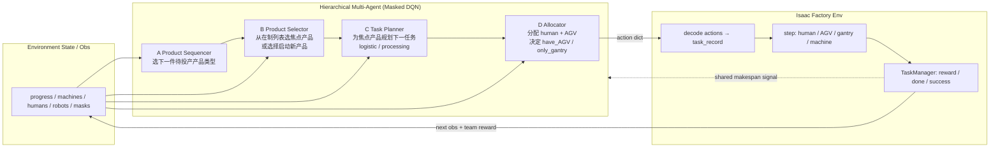

Factory production environment by Isaac Sim
---

# Isaac Sim and Isaac Lab
Built on [NVIDIA Isaac Lab](https://isaac-sim.github.io/IsaacLab/main/index.html) and [NVIDIA Isaac Sim](https://docs.isaacsim.omniverse.nvidia.com/latest/index.html)

# Asset Description

# Product process

水喉

#3.31 
像素图片的坐标：width=2202 pixels, height=1645 pixels
左上角为原点[0,0]，右下角坐标为[2202, 1645]

isaac sim 坐标：
左上角为[55.02995, -6.10027], 右下角为 [-55.0706, 76.16652]
map x bound 55.02995, -55.0706
map y bound 76.16652, -6.10027

TODO：1. 图像像素和坐标需要进行映射，等代码跑起来了再check
      2. Vector Env 加速训练
      3. 定义逻辑接口

The corresponding large map data files are located in the following directory:
"~/work/Dataset/HC_data/map_data"
map_routes_human.json
map_routes_robot.json

map的machine related work id
gantry的停靠位置ids，以及Articulation和实际global位置的关系
还有storage area
带标记注释的地图

全库固定随机种子，训练和test要分开
hc_env_base里面要修改:
        if self._test:
            # np.random.seed(self.cfg_env_base.train_cfg['params']['seed'])
            np.random.seed(1)

如果是vector_env, 所有的物体，需要先设定好target_pose,然后最后用 apply step
还要设计好state的combine和切片
machines我觉得设计成单独类比较好

['/World/envs/env_0/obj/ConveyorBelt_A09_0_0/Belt']

yellowbase05到10存在偏移，坐标不在中心

robot 的路网点id最好和human是通用的，只是有些会有mask掉
然后route这块需要做precomputing

storage 的meta registration info 是否可以忽略

#4.19 
single env的step函数
vector env的step concate apply change

vec env: hc_vector_env_base.py
self.scene.write_data_to_sim()
self.scene.update(dt=self.physics_dt)

#4.24
发现cube等材料有90旋转，需要去掉

#4.29 
human robot reset 函数要修改

#5.4 重力取消

#海创factory

Aligned with a 4-layer real-time factory operations stack (formal academic/industrial terminology):
- Product Sequencing Agent: determine the optimal production order from the current manufacturing request
- Product Selector Agent: choose which product should be prioritized next for detailed task planning
- Process Task Planning Agent: real-time planning of the next key process task for the selected product 
- Human–Robot Allocation Agent: assign each planned task to the most suitable human, robot, or machine resource for execution

#记录gantry的关节位置和local位置的相对偏移关系

#when to set processed_task_record["task_done"] = True? update ongoing task records

#task excution and route generation

#缩短 多层决策带来的时间增加

#还剩带来的route planner 和material 状态， product_to_storage 的任务描述， material的update_task_availability_mask要确保，current task是完成的

#一定要检查是否是原址引用 

storage 的"robot_parking_areas_ids": [9], 不太对

del task record in task manager

storage 的管理

#route manager 需要节省运算空间，只放在vector env里面生成一个就可以

#6.4 logistic 的goal area id的initialize其实可以完善一下（好像也不用）

##6.5 material 的state update 有问题在processing task完成之后不一定就是next task可能是next processing task

6.6 mask要删掉 route函数要检查

# 7.1
可能每个machine都需要一个摄像头

# 7.2
 1. human的颜色改一下方便分辨
 在Raw USD Properties 改 material:binding
  红色 /obj/HC_factory/Looks/material____________1
  绿色 /obj/HC_factory/Looks/material____________2
  蓝色 /obj/HC_factory/Looks/material____________3

 2. 摄像头的种类和位置还要再设计一下
  
 3. 识别的标签，任务要设计一下
      请你帮我
            1. 设计实验
            2. 推荐问题解决方案
      设定   
            人的状态需要通过env中的相机的图片信息提取。
            相机是有多个的，多视角。每个machine的相机只观测machine周围的环境，还有storage. highrise camera可以观测更广的工厂环境
            人的状态(state information)包括: 
                  state (见cfg_human.py) 具体有 free 和 working_task
                  working_task又包含一系列的subtask (见cfg_process_subtask_gallery.py)
            agv和machine的状态是直接可以获取的
      目标  
            通过图片信息，文本信息（主要是task record, 见task_progress_manager.py等），识别人的working_task progress,也就是human进行到了哪一步
            subtask。比如logistic_for_pipe_cutting中                
            "subtasks": [
                    # human: 0, gantry: 1, machine: 2, robot: 3
                    ["go_to_material", "go_to_material", "wait", "go_to_material"],
                    ["material_on_gantry", "wait", "wait", "wait"],
                    ["control_gantry", "carry_to_robot", "wait", "wait"],
                    ["material_on_robot", "wait", "wait", "wait"],
                    ["go_to_goal_area", "move_to_goal_area", "wait", "carry_to_goal_area"],
                    ["material_on_gantry", "wait", "wait", "wait"],
                    ["control_gantry", "move_to_goal_area", "wait", "wait"],
                    ["material_on_goal_area", "wait", "wait", "done"],
                    ["done", "done", "done", "done"],
                ],
      
      输入数据
            应该是一个带前后帧的文本序列，图像序列
            task_record
            task_gallery
            subtask_gallery
      
      任务分解
            根据human环境着装和帽子的颜色不同，识别human id
            根据文本信息, 图像信息推理(比如task_record task_gallery subtask_gallery)识别subtask the human is doing
            识别subtask是doing or done的状态
      提示
            输入是多模态的，这带来了性能的提升。比如
            # human: 0, gantry: 1, machine: 2, robot: 3
            ["control_gantry", "carry_to_robot", "wait", "wait"],
            因为gantry可以直接获取信号，所以一旦gantry的subtask carry_to_robot一旦是done的状态，控制gantry的human也应该是done的状态

            又比如
            ["go_to_material", "go_to_material", "wait", "go_to_material"],
            这个时候human与其他任务是独立的，只能通过图片信息判断，human是否到达指定的位置

## 7.3 目前来说文字数据有点问题
还有摄像头需要加进去

##7.5 subtask time需要加噪声

#7.10 collision check的逻辑

#7.13
告诉图片里面出现了哪些human id robot id
human id和robot id 的状态
如果是working, doing what subtask, done or not done?

考虑小车的中心点偏移

#7.15

关于数据采集和任务定义的更新
参考cfg_perception.py 模板的input 和 output_label

综上识别任务就两个 一个是多视角各个图片中的human id是哪个
第二是识别working human的current subtask

现在需要你： 1.修改相关代码，尤其是perception.py的逻辑，储存的数据格式，读取数据并训练的接口，和终端输出等
2. 要求perception的代码简洁高效

# 7.17 
关于实验随机数的制定
要求每个subtask的完成时间每一次都加上高斯噪声
要求training validate 和测试集的随机数要不同
增加在batch_train里面 把运行代码写进去 方便跑训练

#8.5
agv也加入 processing task里面
发挥agv长距离速度的优势

#8.6
1. 思考实验的设计
多加一个产线
多加一个产品工艺流程么
2. 遇到了长时间序列的训练问题
      buffer的优先级
3. 算法上用CTCE
4. 神经网络上的设计
5. 优化的还是makespan
6. 需要加human fatigue么
7. 实验要证明multi-agent的优势
      强调维度爆炸
8. 需要拉低bad case的下限 增加差异
---

## Multi-agent 实验设计（A→B→C→D）

### 核心主张
- multi-agent 在这里的意义是 **hierarchical action decomposition（分层动作分解）**，不是多个独立理性体各自优化。
- 工厂任务规划与分配（TPA）若做成 flat 单智能体，一步要同时选：产品/焦点 × 工艺或物流任务 × human × AGV → 合法动作近似 **积式爆炸**。
- A→B→C→D 后每层只面对小动作空间 + mask，探索与样本效率才现实；**CTCE（Centralized Training, Centralized Execution）** + 共享 StateEncoder + 共享 makespan 奖励：**分解动作，不拆开目标**。执行时四层串行、共用全局 obs（不是各 agent 仅靠局部观测独立执行的 CTDE）。

### 统一评价口径
所有方法同一环境、同一随机种子协议、同一 `max_episodic_steps`：
- 主指标：Makespan（成功 episode 完成步数）、Success rate（时限内 production_done）
- 辅指标：Truncation rate、累计 reward、达到某 success 所需环境步数（样本效率）
- 报告均值 ± 标准差（≥3–5 seeds）

### 对比方法（按动作是否分层排，算法族先对齐）
1. **Rule-based**（已有）：启发式参考上/下界
2. **Flat single-agent DQN**：联合离散动作 + **同一套 mask 哲学**；网络容量/训练步与分层对齐（避免「flat 被故意饿死」）
3. **Partial hierarchy（消融）**：如 A+B 规则只学 C+D；或 C 规则只学 D
4. **Full A→B→C→D Masked DQN**（主方法）：CTCE + 共享 encoder
5. 可选：**Independent DQN**（分层但不共享 encoder）→ 说明共享表征/CTCE 收益

主线先 **四层都用同一基线算法（Masked DQN）**，证明优势来自分层，而不是某层换了 PPO。

### 规模扫描（把「维度爆炸」画出来）
固定算法，放大问题：产品件数、并行 producing、human 数、AGV 数、工艺段数（小/中/大）。
看曲线：
- Makespan / Success vs 规模
- 有效动作空间大小 vs 规模（flat 积式 vs 分层局部加维）
- 样本效率 vs 规模  
叙事：规模小时 flat 还能凑合；一大则 flat success/样本效率崩，分层 gap 拉大。

### 消融（中等规模即可）
- 有无 action mask
- 有无共享 StateEncoder
- 有无 AGV 参与 processing
- reward：仅 step penalty vs + finish/task/success
- 可选：D 的 human/robot **两头独立 Q** vs **一个联合分配头**

每项只改一个因素。fatigue 先不要进主对比（confound makespan）。

### 异构算法（辅线，主线之后）
每层可以用不同算法（A/B 低频离散、C 强约束、D 资源匹配），但实验要 **先证分层，再证异构**：
- Homogeneous：四层全 Masked DQN（主方法）
- Hetero 小改：只换 C，或 A/B 用规则、C/D 学习（往往性价比高）
- 不要四层四种算法乱炖当主方法；不要 Flat 弱算法 + 分层强算法

### 最小可发表集合
1. Rule vs Flat vs Full MARL（主表，中等+大规模）
2. 规模扫描（产品数或 human 数一条轴即可）
3. 一层消融（去掉 A/B 学习或去掉共享 encoder）

---

## LLM warm-start / 蒸馏（值得试的 Idea）

### 定位
- LLM **不当**每步 TPA 主求解器（尤其不当 Agent D：高频、实时、组合多、贵、难保证合法动作）。
- 最值得试：**生成示范轨迹 → 灌进 buffer / 行为克隆预热 → 再训分层 DQN**（冷启动与样本效率）。
- 可选更轻：LLM 只建议 A（或 A+B）→ mask 过滤 → 其余仍 DQN。

### 流程草案
1. 把结构化状态摘要成短文本（库存/在制/空闲人车/可行动作 mask 列表），约束 LLM **只从合法动作里选**。
2. 用 rule_based 或 LLM+mask 滚若干 episode，得到 `(obs, action_A/B/C/D, …)` 示范。
3. Warm-start：示范进 replay 优先采样，或对各头做短 BC/模仿，再切回 makespan RL（ε 可从较小值起）。
4. 对比：Hier DQN from scratch vs Hier DQN + LLM/Rule demo warm-start（看收敛步数与最终 makespan）。

### 实验叙事注意
- 主文仍证明分层 MARL；LLM 写成 **sample efficiency / cold start** 辅实验，不写成「替代 multi-agent」。
- 报告 LLM 调用次数/费用；若只提升早期收敛、最终 makespan 接近，也是有效结论。
---

## 组会周报草稿（可粘贴 Obsidian: Paper work）

### 0. Multi-agent 逻辑结构（先画这张）

决策顺序固定：**A → B → C → D**，再写入 env；env 推进仿真后反馈 **obs + team reward（makespan 导向）**，各层共享回报做 CTCE 更新。

| Agent | 职责 | 典型输出 |
|-------|------|----------|
| A | 产品序列：是否/投产哪类产品 | product sequencing one-hot |
| B | 产品选择：焦点在制件，或开新件 | product selection one-hot |
| C | 任务规划：该件下一步 logistic/processing | process task one-hot（受 mask） |
| D | 资源分配：派人；是否派 AGV | human / robot allocation |
| Env | 解析动作、推进物理与子任务、结算 RL | next state, reward, done |

要点（给老师一句话）：这不是四个独立工厂，而是 **把组合爆炸的联合动作拆成四层小决策**；目标仍是同一个 **makespan**。

---

### 1. 本周工作（融合进展）

#### （1）训练已启动，详细训练配置仍待确认
- 已开始跑 MARL（A–D Masked DQN + 共享 encoder），具体超参与决策口径还需要定稿。
- **待确认两点（请老师拍板）**：
  1. **训练阶段**：每个时间步模型是只为「当前焦点的单个产品」决策，还是对「所有在制/可决策产品」做决策？
  2. **测试阶段**：决策范围同样是 **单产品** 还是 **全产品**？训测是否必须一致？
- 现状实现偏 **分层逐步决策**：A/B 决定焦点与是否新品，C/D 主要服务当前选中的产品与任务（不是一步对所有产品同时输出完整 TPA 方案）。若老师希望「每步全局联合任务规划与分配」，需要改动作接口与实验定义。

#### （2）增强仿真中 AGV 的参与度
- 此前 AGV 主要参与 **物流（logistic）**；现已扩展到 **加工（processing）** 相关的转运/卸料链路（have_AGV 模板）。
- 设定上体现 AGV 相对龙门架的 **长距离速度优势**（空载更快；有载降速），以贴近「AGV 跑远距、龙门架做短距吊运」的分工。

#### （3）加工相关时长按工业场景加长
- 上调 human 侧操作/加工计时（如 `control_machine`、上下料类 subtask 时间），使单段加工更接近真实节拍。
- 副作用：整条工艺链 **总完工时间（makespan）明显变长**，已相应提高 episode horizon（如 `max_episodic_steps=45000`），否则易大量 truncation，训练信号失真。

#### （4）其他支撑（可略讲）
- 修复龙门架间距约束下的移动死锁，保证长 episode 可跑通。
- 明确论文侧实验主线：Rule / Flat / Full 分层；规模扫描强调维度爆炸；LLM 仅作 warm-start 辅线。

---

### 2. 问题与讨论
1. 训/测「单产品决策 vs 全产品决策」口径统一问题（见上）。
2. 加工时间加长后，成功 episode 变稀、信用分配更难 → 是否优先上 **demo warm-start / 优先 replay**，再扩规模实验。
3. fatigue / 多产线：建议暂不进主对比，避免冲淡 makespan 与分层优势叙事。

---

### 3. 下周计划
- [ ] 与老师确认训测决策范围（单产品 / 全产品）并写进实验协议
- [ ] 稳住当前规模下的 MARL 训练曲线（success / makespan / truncation）
- [ ] 起草 Flat baseline 的动作与 mask 对齐方案（为对比实验做准备）
- [ ] （可选）Rule/LLM 示范轨迹 → buffer 预热的最小实现设计

---

### 4. 请老师确认
1. 训练与测试的决策范围：单产品焦点 vs 全产品，是否必须一致？
2. 主实验是否先做：**Rule vs Flat DQN vs Hier A–D DQN**（算法族统一）？
3. LLM warm-start 本阶段做不做、做到哪一层（建议仅 A/B 或离线示范）？
