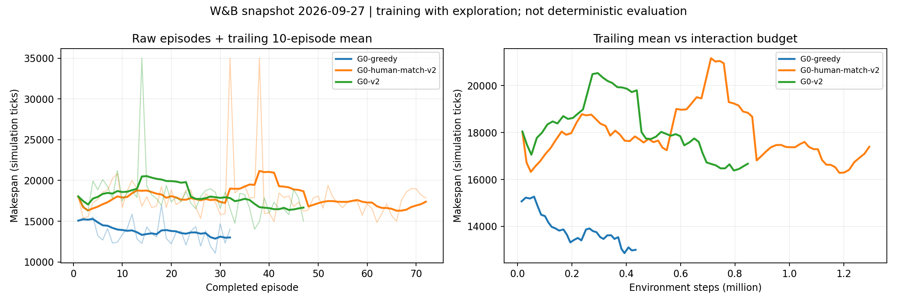

# G0 / G0-greedy 训练诊断

日期：2026-09-27。W&B 只读快照；代码审计基于本地 HEAD fe0741d1。没有修改训练实现或中断运行。远端运行来自不同机器，未逐文件核验其启动时源码与本地完全一致，因此代码缺陷不能直接解释成已经测得的远端因果贡献。

归档说明：本文记录修改前的诊断。后续实现及实验命令见 [R 系列](experiment_r_series.md)。

## 结论

存在更好调度策略，不等于目前的分层 DQN 更新必然学到它。当前最优先处理的是决策/回放/后续价值定义的一致性，再讨论网络结构、探索预算和奖励。已经确认：训练在发生，纯 RL 有一定改善；尚未证明收敛，更没有证明 greedy 达到理论最优。

G0-greedy 固定的只有 D-human，规则为合法集合中的 argmax(efficiency × clipped task skill)。A/B/C/D-robot 仍训练。规则不考虑全部子任务技能、未来疲劳、路程与下游资源，11083 只能称为该快照的最好观测值。最优性证明需要可比模型的下界或求解器证书。

## W&B 实测

使用 scan_history 读取完整 episode 记录，按 (episode, Train/step) 去重；G0-v2 有一条重复 ep44，不去重会把最近 10 局均值误算为 16755。

| run | 完成局数 | 最低 makespan | 前10均值 | 后10均值 | 失败局数 | 最后一局末 epsilon |
|---|---:|---:|---:|---:|---:|---:|
| G0-greedy l4fij7xx | 32 | 11083 | 13916.9 | 13002.2 | 0 | .725，工人规则不受其影响 |
| G0-v2 rmcrfoxr | 47 | 14010 | 18577.4 | 16670.6 | 1 | .463 |
| G0-human-match-v2 hzpvkyr3 | 72 | 14850 | 17904.1 | 17390.5 | 2 | .180 |
| G0-v3 sjs312c5 | 1 | 18043 | — | — | 0 | .989 |

前三十二局：greedy 13580.78，G0-v2 18710.56，差约 27.4%。但相同 episode 数不代表相同交互预算；见 training_curves.png 的第二面板。G0-v2 的前后10局改善约10.3%，不能说完全没有学习。最近10局 greedy 比 G0-v2 低约22.0%，但窗口所处预算和 epsilon 不同，只是描述性比较。

所有快照主要超参数一致：gamma=.9999，decision_reward_scale=.01，lr=encoder_lr=.0001，batch=64，A batch=16，epsilon 1→.05 / 150万 tick，PER、dueling、Double DQN 开启。G0-v2 结束时约84.7万 tick，尚未走完探索日程。G0-human-match 同时修改网络和奖励，不是纯网络消融。G0-greedy 在 Windows，其他运行在 Linux；要补充代码/环境 profile/技能表 hash 才能严格排除动力学差异。

W&B 顶层 env max_episodic_steps=64000，与嵌套训练配置35000不一致。现有失败 makespan 与 G 脚本支持35000口径；正式评估应记录实际运行中的有效 horizon，而不是只读顶层默认值。

## 已确认的实现问题与影响机制

### 1. A 的有效决策被过滤

hierarchical_tpa.py:768 的 _had_meaningful_decision 仅检查 dispatch_list。其注释称没有 dispatch 的 sequencing 不改变工厂，但环境 task_progress_manager.py:248 的 decode_action_product_sequencing 会写 next_product / next_product_index，影响后续释放及 mask。

CPU 独立诊断（seed9002、gap、规则调度、1500 tick）发现 3 次 A-only 动作，均把 next_product 从 null 改为 ProductWaterPipe；另有2次 A 与 dispatch 同步。这3次会被当前 pending/replay 路径遗漏。W&B G0-v2 的 A buffer 仅152条，远小于其他头5万，符合稀疏且可能漏记的现象，但不能仅用152推算远端遗漏率。

修复方向：各层独立识别有效决策，保留 A-only 状态变化，按该层决策时钟结算转移。不能靠增加 A 的 reward scale 补回缺失样本。

### 2. “提议分配”与“实际启动”混在一起

task_progress_manager.py:365–375：没有所需 AGV 或指定区域龙门忙时，update_new_task_record 返回 False；上层 step 不反馈这个结果。与此同时 _had_meaningful_decision 只要看到 dispatch_list 就创建/关闭 decision interval，D 的 observe_step 只要求工人 one-hot 非零便存 replay。

同一个 CPU 探针：230次提议、11次真实 start，219次未启动。这个95.2%的比例仅描述该探针，不是 G0 的统计。其意义是证明：当前回放可以大量记录根本没让工人开始工作的动作，因而效率技能差异不会出现在这些样本的真实结果中。

注意：被拒绝动作在一个“尝试分配”的 MDP 中可以是合法自环，不能简单宣称所有失败尝试都不该学习。正确处理是让 C/调度器学习等待与资源可行性，同时避免把未经执行的人员选择当作加工效果样本；或者统一 mask 与环境启动条件，消除不可执行提议。需记录 requested/accepted/rejected/reason 和实际执行的 human/robot。

### 3. 下一状态沿用旧的父动作，Bellman 目标不闭合

Transition 只有 context，没有 next_context。hier_rl_agents.py:254–269 在编码 pre / next_pre 时都传同一 transition；D 的编码 lambda（约996–1004）对两端都用旧 c_plan。C 的 next_mask（约785）也用旧 b_sel。

实际时序：本轮 C 选任务 c_t、D 选工人；下一次全局 meaningful decision 可能服务另一件产品/另一个任务 c_{t+1}。当前 target 却是 R + gamma^dt max_h Q_D(s_next, c_t, h)。它估计的不是下一轮实际 D 决策。同理，C 在下一状态为旧 slot 求值，slot 还可能已经忙碌或索引语义改变。

应选一种一致定义：每层连接到该层下一次真正决策（保存新的父上下文和实际合法集）；或者用联合状态价值 V(s_next) / centralized critic 作为跨全局决策的 continuation。不能只是把全局 s_next 配上旧父动作。

### 4. K 次步内 dispatch 没有保存逐次资源状态；C 的 none mask 不一致

hierarchical_dispatch.py:190–235 使用更新后的 pool 给动作做合法性过滤，但 C/D 的网络输入仍为 tick 起点 pre。dispatch_list 不保存完整的局部 pre、prefix、mask；hierarchical_tpa.py:851–899 为每条 dispatch 存同一 prev_obs/next_obs/team reward；D.observe_step 从原始 pre 重新取 human_mask。

这并不意味着已确认重复派工：执行阶段的 pool mask 确实防止重复分配。问题在训练表示：后一个分配没有看到前一个分配的资源消耗/条件，无法准确学习该顺序位置的边际价值。

另一个可直接核对的不一致：执行时 _c_mask_for_rl_act 在真实任务存在时去掉 none（配置 always）；C.observe_step 的 next_mask 则来自未经相同处理的原始行。因而 target argmax 可能选到执行禁止的 none。如果该 Q 被高估，目标会传播一个行为策略根本不会执行的后续动作。发生频率仍需打点。

修复：显式记录每次 dispatch 的局部状态、已用资源、合法集；推理和目标生成共用同一可行性函数。一次并发联合动作也可以整体建模，但必须明确联合价值定义。

## 次级原因：为什么加入网络与 shaping 仍不够

### 5. 工人特征存在，但匹配结构弱

hier_networks.py:346–403 包含疲劳、效率、human_idx、任务/子任务技能，并经共享 MLP 后 mean pool 为64维，再进入全局256维 latent；hier_obs.py:encode_D 再拼任务 one-hot，由 MLP 输出工人 Q。

所以不是“RL 看不到技能”，也不能因为 mean pool 就断言工人身份完全丢失（human_idx 已输入）。但要求网络从压缩的集合摘要恢复每个工人的 task-conditioned 分数，会比逐候选的 Q(s,task,h) 难学。优先保持工人 token，用共享 scorer、任务交叉特征/attention 和明确候选 mask。

human-match 已引入候选特征和可学习 log-speed prior；仍然沿用上述 TD/replay 路径，并同时加 shaping。它的失败不能证明任务不适合 RL，也不能证明候选结构无用。

### 6. 共享编码器没有慢速 target 副本

MaskedDQNAgent.target_net 只复制 Q 头；pre 与 next_pre 都经在线 obs_encoder 编码。_joint_learn 同时用所有头 loss 更新共享 encoder。因此 target head 虽慢更新，target 的输入表示仍随在线梯度即时漂移。

这是稳定性风险，不是单凭静态代码就能证明的发散。建议给 encoder 也设置 EMA target，用在线编码选择动作、目标编码计算 Double-DQN bootstrap；记录 encoder梯度、Q-gap、target drift。经典 DQN 使用独立目标网络的理由见 https://doi.org/10.1038/nature14236 。

### 7. match 的奖励实际主要是疲劳惩罚

hzpvkyr3 ep72：时间−1426.96，错配−0.50114，过劳−46.47778，任务完成+8.3，产品完成+20，成功+24.51857。疲劳项绝对值约错配项的92.7倍。错配在分配事件上结算，疲劳可持续逐tick累积，因此只比较配置系数 .05 与 .01 会误判权重。

经过 decision_reward_scale=.01，错配的整局总量仅约−.005（这里未计折扣，不是每条 TD 的实际值）。D-human Huber loss 非零并不足以证明这个微弱区分信号被学到；需要记录同状态候选动作的 Q差、选错率和真实后续工时。

增加 shaping 可能改变目标。例如持续惩罚疲劳可能鼓励低疲劳但技能不合适的分配；其净作用必须做匹配项/疲劳项单独消融。若要求保持原最优策略，可考虑 SMDP potential shaping F=gamma^dt Phi(s_next)−Phi(s)，同时满足终端势处理；理论条件见 https://ai.stanford.edu/~ang/papers/shaping-icml99.pdf 。不要直接放大奖励后把提升归因于原 makespan 目标。

### 8. 探索与评估口径

G0-v2 尾部 epsilon 仍约.46。若某状态有m个合法工人，且利用分支已经完美，选择最优工人的概率也只有 1−epsilon+epsilon/m；m=5时约.63。greedy 人分配则一直用规则，不经过这条随机分支。因此训练曲线差距混合了“策略知识差距”和“执行探索的成本”。

当前没有在查询项目中找到 G0 的对应命名 epsilon=0评估 run。应固定 checkpoint、环境配置和 seeds 做纯RL/同checkpoint仅替换D-human/greedy训练策略对照；不能拿训练最低点与另一组尾部均值混作最终性能。

## 奖励与折扣：排除一个常见误判

实际 gamma=.9999，每tick折扣半衰期约6931 tick，1000tick后权重约.905，10000tick后约.368。因此不是默认gamma=.99造成长期收益完全消失。35000tick的全局远期信用仍困难，但这不是当前最强证据。

基础奖励为−.08/tick、+2/产品、+.1/任务、+50(1−T/35000)成功奖励。固定成功订单、固定工序数量且不折扣时：G = constant −(.08+50/35000)T，确实与较小makespan一致。使用折扣后还偏好提前完成中间任务；失败和shaping另有影响，但不能笼统称“奖励目标根本不对”。

各头共享团队回报本身并非错误；问题是没有正确条件化其他决策、所有头同步变化、相同间隔回报难以辨别究竟哪个人的效率导致收益。PER/dueling 能改善某些学习性质，但不会自动修复错误的转移定义。

## 建议的实验顺序和验收标准

1. **先冻结证据**：记录有效horizon、动力学/技能表hash、代码commit、每局seed与epsilon；记录真实accepted分配比例、候选数>1比例、父上下文变化率、C非法none成为target比例、各头实际更新数、TD目标量级与Q-gap。
2. **epsilon=0 同checkpoint替换诊断**：固定A/B/C/机器人及独立开发seeds9001–9010，仅替换工人为贪心。测成功率、makespan、真实匹配率与空闲/瓶颈时间。此步骤区分探索损失与已学策略损失；从训练过greedy的另一checkpoint不能完全隔离D的因果贡献。
3. **先修转移一致性**：A-only记录；accepted/rejected语义；next_context或联合continuation；C与D局部mask/prefix。清空旧语义回放，不能混训旧数据。每项都有最小回归例：A-only状态变化必须有样本，拒绝启动不得产生伪加工效果标签，next target上下文匹配下一真实决策，target合法集与执行一致。
4. **只训练D-human**：冻结其他策略，固定规则/固定checkpoint产生稳定的上游分布。候选打分网络先做可学习性检查：能否在保留疲劳/技能状态的留出集拟合贪心排序（监督诊断，不声称纯RL结果），然后只用RL检验能否追上贪心。
5. **训练稳定性与奖励消融**：依次试target encoder、时间跨度适配的n-step/任务完成回传、match结构、仅匹配shaping、仅疲劳shaping。避免同时修改多个因素。按有效决策数而不只按空转tick设计探索日程，保留周期epsilon=0开发评估。
6. **最终报告**：每组多个训练seed、固定交互预算；独立验证集选checkpoint，测试集只用于最终报告。失败率与含失败惩罚指标和成功makespan同时给出。长训练在这些问题修正前不是优先投入。

## 本次产物

- runs.json：W&B配置/summary快照，不含API key。
- *_episodes.json：完整episode原始记录；*_sampled.json：采样诊断指标（非完整时间序列）。
- statistics.json、analyze.py、training_curves.png：去重统计与图。
- probe_dispatch.py、dispatch_probe.json：独立CPU诊断，可复现A-only状态变化与分配拒绝路径。

本次没有重新训练模型、没有运行完整的checkpoint对照评估。上述实现机制已经由源码/小实验支持，但各因素对原G0性能差距的贡献需按实验顺序量化。
