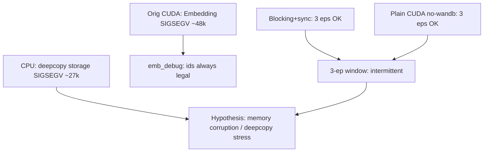

# R0 SIGSEGV（Embedding 定点）诊断：2026-09-29

## 结论与确定性

- **已确定**：正常 CUDA 训练在 `StateEncoder._encode_ongoing` → `_e("next_logistic_id")` → `torch.nn.Embedding.forward` 发生 **SIGSEGV**（非 Python `IndexError`）。证据：`outputs/train_monitor/run_20260929_212013_7t0sz6vu`，约 step 48400 / episode 2。
- **已排除**：OOM（RSS≈2 GB）、普通 id 越界（`_clamp_id` + `HC_EMB_DEBUG` 快照显示 index 始终在 `[0, num_embeddings)`，weight finite、device 与索引一致）。
- **短窗可过**：同一 seed、`HC_MAX_HARD_EPISODES=3` 下：
  - `CUDA_LAUNCH_BLOCKING=1` + `HC_CUDA_SYNC_ENCODE=1` → **成功**（`run_20260929_215428_g6rjbmce`，54770 steps）。
  - **无** blocking / sync、且无 W&B 的普通 CUDA → **也成功**（`run_20260929_225403_unw3tnuk` / `overnight-noblock-S42`，同样 54770 steps，越过 ~48400）。
  - 因此原崩溃在 3 局窗内 **非必现**；不能把「blocking 成功」单独解读为已修好异步根因。
- **CPU 隔离**：仍可出现原生层 SIGSEGV，但栈不同——落在 `copy.deepcopy` / `torch.Tensor.__deepcopy__` / `torch.storage`（`tpa_info_pool.TpaInfoPool.__init__`），不是 Embedding。另有一次 CPU 跑在 route 层以 `AttributeError: '_RoadmapGraph' object has no attribute 'get'` 失败（非段错误）。
- **W&B**：CPU2 与 overnight-noblock 均为 `HC_R_WANDB=0` 仍（CPU）SIGSEGV /（CUDA）成功；W&B 不是必要触发条件。

尚不能把根因钉死为某一个 CUDA kernel 或某一行业务逻辑；原 Embedding SIGSEGV 属 **间歇性**。优先加固 `TpaInfoPool` deepcopy，并做更长程无 blocking 复现。

## 原始崩溃（faulthandler）

- 证据：`outputs/train_monitor/run_20260929_212013_7t0sz6vu`
- `status.json`：`returncode=-11` / `SIGSEGV` / 约 1388 s
- 当前线程栈（摘要）：

```text
torch/nn/modules/sparse.py:192 Embedding.forward
hier_networks.py:267 _e
hier_networks.py:276 _encode_ongoing   # next_logistic_id -> task_emb
hier_networks.py:482 StateEncoder.forward
hier_obs.py:105 encode_A
hier_rl_agents.py:486 act
decision_consistent.py:128 build_decision_action
hierarchical_tpa.py train/act
```

## 诊断开关（默认关闭）

已在 [`source/algo/hierarchical/hc_factory/hier_networks.py`](../source/algo/hierarchical/hc_factory/hier_networks.py) 加入：

| 环境变量 | 作用 |
|----------|------|
| `HC_EMB_DEBUG=1` | `_e` 在 `emb(...)` 前写 id / clamp / weight 快照 |
| `HC_EMB_DEBUG_EVERY` | 采样间隔（默认 100） |
| `HC_EMB_DEBUG_NAMES` | 默认 `next_logistic_id`；`*`/`all` 记全部 |
| `HC_EMB_DEBUG_PATH` | 日志路径（默认 `outputs/train_monitor/emb_debug.log`） |
| `HC_CUDA_SYNC_ENCODE=1` | `_encode_ongoing` 前 `torch.cuda.synchronize()` |

启动封装：[`tools/diag_r0_emb_segv.sh`](../tools/diag_r0_emb_segv.sh)（`cuda-blocking` / `cpu` / `no-wandb`）。  
单元测试：[`tests/test_emb_debug_probe.py`](../tests/test_emb_debug_probe.py)。

## 隔离结果

### A. CUDA_LAUNCH_BLOCKING + HC_CUDA_SYNC_ENCODE

- 命令：`bash tools/diag_r0_emb_segv.sh cuda-blocking`（`HC_MAX_HARD_EPISODES=3`，seed 42）
- 证据：`outputs/train_monitor/run_20260929_215428_g6rjbmce`
- Emb 日志：`outputs/train_monitor/diag-emb-cuda-blocking-S42_emb_debug.log`
- **结果：成功**。`episodes_done=3`，`steps=54770`，无 SIGSEGV；越过原 ~48400 崩溃步。
- Embedding 快照示例：`t_device=cuda:0`，`t_max≤13`，`num_emb=32`，`w_finite=True`。

### B. CPU-only

1. `run_20260929_215445_sk1tr86d`（与 CUDA 并行）：`AttributeError` in `route.py` `_sample_to_pose`（`sample` 实为 `_RoadmapGraph`）。**非 SIGSEGV**。
2. `run_20260929_221051_5at8wdgg`（cpu2，`HC_R_WANDB=0`）：约 step 26700 **SIGSEGV**，栈为：

```text
torch/storage.py __new__
torch.Tensor.__deepcopy__
copy.deepcopy
tpa_info_pool.py:39 TpaInfoPool.__init__   # deepcopy(machine)
decision_consistent.py build_decision_action
hierarchical_tpa act/train
```

说明：CPU 上也会原生崩溃，但触发点是 **env 状态 deepcopy**，与原始 Embedding 栈不同；二者可能同属内存损坏，或为独立问题。

### C. 关 W&B + 普通 CUDA（无 blocking）

- cpu2：`HC_R_WANDB=0` → 仍 SIGSEGV（deepcopy 栈）→ **不能把根因归给 W&B**。
- `overnight-noblock-S42`：无 `CUDA_LAUNCH_BLOCKING`、`HC_CUDA_SYNC_ENCODE=0`、无 W&B 登录行。
  - 证据：`outputs/train_monitor/run_20260929_225403_unw3tnuk`
  - 状态环：`outputs/train_monitor/overnight_r0_emb_loop/STATE.json`（`result.ok=true`）
  - **结果：成功**。`episodes_done=3`，`steps=54770`，无 SIGSEGV（越过原崩溃步）。

## 解读



优先假设：

1. **间歇性原生损坏**：短窗（3 局 / ~55k steps）多数可过；原 Embedding SIGSEGV 非必现。
2. **`deepcopy` 张量图**可在 CPU 上单独 SIGSEGV（storage/`__deepcopy__`），与 Embedding 崩溃可能同源或并列。
3. **异步 CUDA** 仍可能放大触发率，但 blocking 并非 3 局成功的充分必要条件（noblock 同样成功）。
4. 次要：Torch 2.7.0+cu128 原生缺陷（需原生栈 / 版本对照后才可认定）。

## 建议的下一步（未在本阶段改算法）

1. 更长程无 blocking 复现（例如 10–20 局或直到再次 SIGSEGV）；若再现 Embedding 栈，用 `cuda-gdb` / `TORCH_SHOW_CPP_STACKTRACES` 抓原生栈。
2. 将 `TpaInfoPool` 的 `copy.deepcopy` 改为显式浅拷贝 + 必要字段 clone（减少 tensor storage 深拷贝面），作为低风险加固实验。
3. 保持 `HC_EMB_DEBUG` 默认关闭；复现时打开并把最后一行快照贴进本笔记。

## 相关路径速查

| 项 | 路径 |
|----|------|
| 原始崩溃 | `outputs/train_monitor/run_20260929_212013_7t0sz6vu` |
| CUDA blocking 成功 | `outputs/train_monitor/run_20260929_215428_g6rjbmce` |
| 普通 CUDA 无 blocking 成功 | `outputs/train_monitor/run_20260929_225403_unw3tnuk` |
| CPU deepcopy SIGSEGV | `outputs/train_monitor/run_20260929_221051_5at8wdgg` |
| 前序无栈诊断 | [`docs/training_crash_diagnosis_2026-09-28.md`](training_crash_diagnosis_2026-09-28.md) |

## Overnight live run (2026-09-30)

- Full R0 `overnight-diag-S42` evidence `run_20260930_003542_oelq7tha` ran to **step≈275700 / episode=14** without Embedding SIGSEGV.
- Then failed with **Python `TypeError: unhashable type: 'dict'`** inside `torch.Tensor.__deepcopy__` while `TpaInfoPool` did `copy.deepcopy(robot)` (`tpa_info_pool.py:38`), via `build_decision_action` → `DecisionPool`.
- Fix applied: `clone_env_subtree()` (tensor `detach().clone()` + recurse) replaces naive `deepcopy` for progress/material/human/robot/machine/masks.
- Relaunch #1: `overnight-diag-S42-re1` / evidence `run_20260930_025625_ayf2sxn5` / W&B https://wandb.ai/rl-driving/HcFactory_TPA/runs/jyircthc

### re1 overnight SIGSEGV (2026-09-30 ~03:59)

- Evidence: `run_20260930_025625_ayf2sxn5` after `clone_env_subtree` fix.
- Died at **step≈139600 / episode=7**.
- Current thread: `hier_networks.py:361` `_encode_ongoing` **`torch.stack` of continuous fields**, via `encode_D` → `compute_loss` (learn path).
- Last emb_debug: ids still legal (`t_max≤13`, `num_emb=32`).
- Relaunch #2 (limit): `overnight-diag-S42-re2` / `run_20260930_040104_s5cdogtu` with `CUDA_LAUNCH_BLOCKING=1` and `HC_CUDA_SYNC_ENCODE=1`.

### re2 overnight SIGSEGV with CUDA_LAUNCH_BLOCKING (2026-09-30 ~04:33)

- Evidence: `run_20260930_040104_s5cdogtu` (`CUDA_LAUNCH_BLOCKING=1`, `HC_CUDA_SYNC_ENCODE=1`).
- Died at **step≈55800 / episode=3**.
- Current thread: `hier_obs.py` `_to_device` (recursive) → `preprocess` → `encode_D` → learn/`compute_loss`.
- Blocking **did not** eliminate SIGSEGV; failure site moved (re1: `_encode_ongoing`/`torch.stack`; re2: `_to_device`).
- Auto-relaunch budget (2) exhausted; overnight loop **stopped**.
- Morning handoff: prefer investigating replay/`pre` tensor lifetime into `encode_D`, or Torch/CUDA native stack; Embedding OOB remains unsupported by emb_debug.

## Device-path hardening (2026-09-30 morning)

Overnight stacks all sit on **learn/encode** (`encode_D` → `preprocess` → `_to_device` / `_encode_ongoing`), i.e. replay `pre` already moved by `pre_to_device` then encoded again via `preprocess` → redundant `.to()`. Applied:

| Change | File |
|--------|------|
| `encode_*(..., pre=pre)` skips `preprocess→_to_device` when caller already has device `pre` | `hier_obs.py`, `decision_consistent.py`, `hier_rl_agents.py`, `hierarchical_tpa.py` ORU, `duration_aux.py` |
| `_to_device` / `pre_to_device` skip tensors already on target device | `hier_obs.py`, `hier_utils.py` |
| `event()` uses `detach_pre_to_cpu` only (no `copy.deepcopy`); `detach_pre_to_cpu` always `.clone()` for immutable CPU snapshots | `decision_consistent.py`, `hier_utils.py` |
| Prior: `clone_env_subtree` for `TpaInfoPool` | `tpa_info_pool.py` |

Unit tests: `tests.test_decision_consistent` + `tests.test_emb_debug_probe` pass after patches.

### Verify run — aborted by desk hard-freeze (2026-09-30 ~12:33)

- Tag: `verify-devicepath-S42` / evidence `run_20260930_121908_jp_vyns5`
- Ran ~14 min to **step≈27700 / episode=1**, then host froze; rebooted **15:03**.
- **Not** Embedding/SIGSEGV/OOM：`console.log` 无 Fatal；末次监控 `mem_used_pct≈17.5%`、train RSS≈1.9 GB、GPU≈4.1 GB；上一 boot 内核无 Xid/soft lockup/OOM（硬卡死常来不及落盘）。
- 监控全程 `hypothesis=gui_plus_train_risk`：同一 4090 上 **display_active + G6/C1**（Xorg/gnome-shell/Cursor/chrome/obsidian/Codex + `HcFactory`）。
- 结论：卡死是 **桌面显示与训练算力争用同一 GPU** 的主机级挂起，不是本次 device-path 修补的算法 SIGSEGV。复验应在无图形会话（`multi-user.target` / 关掉占用 GPU 的桌面客户端）下跑。

## Closed-loop R0-debug (2026-09-30 ~15:10)

- Supervisor: [`tools/closed_loop_r0_debug.py`](../tools/closed_loop_r0_debug.py)
- State: `outputs/train_monitor/r0_debug_loop/STATE.json`（`touch .../STOP` 停止）
- W&B name: **`R0-debug-N10`**（relaunch → `R0-debug-reN-N10`）
- Policy: 100 hard eps, seed 42, `HC_EMB_DEBUG=1`, no blocking initially; on known SIGSEGV surfaces auto-relaunch (max 8) and escalate to `CUDA_LAUNCH_BLOCKING`+sync when classified.

### Closed-loop tick (2026-09-30T16:29:11+08:00)

- Recovered missed crash `R0-debug` `segv_stack_ongoing` step=58900 evidence=`/home/xue/work/isaac_factory/outputs/train_monitor/run_20260930_151040_2_9ppnmu` (supervisor had died).
